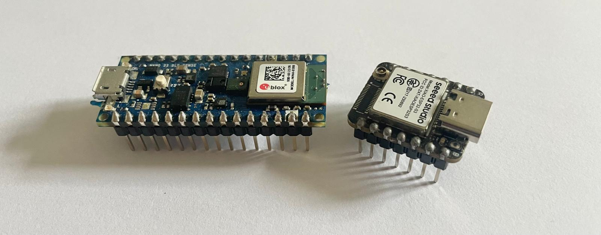

# AIoT Engineering

**16 hands-on labs, one per chapter, for building AI-powered IoT systems from the sensor up to the cloud.**

This is the companion lab repository for *AIoT Engineering* by Walid Abdaoui, published by Elektor. Each lab is full runnable code: Docker stacks, real firmware for real boards, and a step-by-step procedure with expected output at every stage. Read this page before starting any lab.

## Contents

- [Before you start: prerequisites](#before-you-start-prerequisites)
- [Startup tutorials](#startup-tutorials)
- [Labs 1 to 16](#labs-1-to-16)
- [Conventions](#conventions)
- [Something is wrong](#something-is-wrong)
- [License](#license)

Every lab folder is self-contained: its own README, its own Docker Compose file or PlatformIO project, its own `tests/smoke.sh`. `cd` into a lab's folder and everything you need to run it is right there.

## Before you start: prerequisites

Docker, Python, Node.js, an ESP32-S3, a Nano 33 BLE Sense, a Raspberry Pi, depending on which labs you run. None of them are needed all at once, and no lab in Part I needs more than a laptop plus Docker.

**[See the full prerequisites and per-lab hardware/software list →](./docs/prerequisites.md)**

## Startup tutorials

Seven step-by-step tutorials, each covering Windows, macOS, and Linux. Do the ones your path through the labs needs, the [prerequisites page](./docs/prerequisites.md) tells you which.

| # | Tutorial | Covers |
| :---- | :---- | :---- |
| T1 | [Docker startup](./tutorials/docker-startup.md) | Docker Desktop (Windows/macOS) or Docker Engine plus Compose v2 (Linux). Verifying the install. Which shell to use on Windows. |
| T2 | [ESP32-S3 startup](./tutorials/esp32-s3-startup.md) | Driver and port detection, PlatformIO install, first flash. The fast path onto the chip. |
| T3 | [FreeRTOS for ESP32-S3 startup](./tutorials/freertos-esp32-s3-startup.md) | Installing raw ESP-IDF, the toolchain PlatformIO hides. What FreeRTOS actually gives you. Building and flashing with `idf.py`. |
| T4 | [Raspberry Pi startup](./tutorials/raspberrypi-startup.md) | Imaging the SD card headless, first SSH login, installing Docker on the Pi. |
| T5 | [Arduino Nano 33 BLE startup](./tutorials/arduino-nano33ble-startup.md) | Arduino IDE 2.x, the Mbed OS Nano board package, first upload, verifying the onboard IMU. |
| T6 | [Node-RED startup](./tutorials/nodered-startup.md) | Flows, nodes and Deploy explained, running Node-RED in Docker versus natively on the host, the Node-RED Dashboard, and a real config-node bug worth knowing about. |
| T7 | [Jetson Nano startup](./tutorials/jetson-nano-startup.md) | Flashing the SD card image, first boot with a monitor, SSH in, verifying the GPU with `tegrastats`/`jtop`, Docker with GPU passthrough. |

## Labs 1 to 16

Each row links to that lab's own `README.md`, the full self-contained procedure with every command, every expected output, and its own troubleshooting table.

| Lab | Chapter | What you build | Folder |
| :---- | :---- | :---- | :---- |
| 1 | Chapter 1: IoT Platforms | Simulated devices publish MQTT telemetry, Node-RED processes it into Redis, and a Streamlit dashboard reads it back live. | [ch01-mosquitto-nodered/](./ch01-mosquitto-nodered/README.md) |
| 2 | Chapter 2: Hardware and Firmware | Flash the same workload to a real ESP32-S3 three ways, a polling super-loop, correct FreeRTOS priorities, broken ones, and measure worst-case latency. | [ch02-rtos-latency/](./ch02-rtos-latency/README.md) |
| 3 | Chapter 3: Connectivity | Measure the real network cost of a telemetry message under MQTT and HTTP, with and without TLS, from packet captures. | [ch03-mqtt-vs-http-cost/](./ch03-mqtt-vs-http-cost/README.md) |
| 4 | Chapter 4: Securing IoT and Edge AI Systems | Build a two-level PKI from scratch, issue per-device certificates, and break mutual TLS and per-device authorization on purpose. | [ch04-pki-security/](./ch04-pki-security/README.md) |
| 5 | Chapter 5: Edge Computing and Digital Twins | Close the loop between a platform's desired state and a device's reported state through a Device Twin. | [ch05-edge-device-twin/](./ch05-edge-device-twin/README.md) |
| 6 | Chapter 6: Data Intensive AIoT Platforms | Stream a real Nano 33 BLE Sense over USB serial through Node-RED into TimescaleDB, with a live dashboard. | [ch06-imu-streaming/](./ch06-imu-streaming/README.md) |
| 7 | Chapter 7: EDA and Dataset Preparation | EDA on raw environmental telemetry, then a stratified train/val/test split. | [ch07-eda-dataset-prep/](./ch07-eda-dataset-prep/README.md) |
| 8 | Chapter 8: Signal Processing and Feature Engineering | Turn raw motor vibration into FFT and Butterworth spectral features a model can score. | [ch08-fft-vibration/](./ch08-fft-vibration/README.md) |
| 9 | Chapter 9: Supervised Learning | Train a yes/no/idle gesture classifier on the Nano 33 BLE Sense, exported as a 7 KB int8 `.tflite`. | [ch09-gesture-classifier/](./ch09-gesture-classifier/README.md) |
| 10 | Chapter 10: Anomaly Detection | Catch a bearing fault on vibration features at a sub-5% false-alarm rate. | [ch10-isolation-forest/](./ch10-isolation-forest/README.md) |
| 11 | Chapter 11: Model Deployment | Deploy the Chapter 9 gesture model to ESP32-S3 and Nano 33, measuring accuracy delta and p99 latency. | [ch11-tflm-deployment/](./ch11-tflm-deployment/README.md) |
| 12 | Chapter 12: TinyML Frameworks | Benchmark the same model across three runtimes, TFLite Micro, ESP-NN, CMSIS-NN, and two boards. | [ch12-runtime-benchmark/](./ch12-runtime-benchmark/README.md) |
| 13 | Chapter 13: Model Compression | Shrink the gesture model with quantization and pruning, then distil a 4 KB student that beats it. | [ch13-model-compression/](./ch13-model-compression/README.md) |
| 14 | Chapter 14: Embedded Vision | Measure camera capture and inference, deploy a compact classifier or detector, publish over BLE. | [ch14-fomo-presence/](./ch14-fomo-presence/README.md) |
| 15 | Chapter 15: Tiny Transformers | A wake word detected entirely on a Nano 33 BLE Sense triggers a local LLM to generate a question, over serial, through Node-RED. | [ch15-micro-transformer-kws/](./ch15-micro-transformer-kws/README.md) |
| 16 | Chapter 16: Industrial AIoT and MLOps (capstone) | Three PLC-bridged production lines, anomaly scorers hot-swapped by signed OTA, drift-triggered retraining. | [ch16-industrial-mlops-capstone/](./ch16-industrial-mlops-capstone/README.md) |

## Conventions

Code is set in monospace in the book and lives here in full: every Dockerfile, config, script, and dashboard. Every lab ships a `tests/smoke.sh`. Run it bare for a fast structural check, or `FULL=1 ./tests/smoke.sh` to actually bring the stack up and verify it end to end. This is a good way to confirm your environment works before doing a lab by hand.

Numbers in this book are stated precisely on purpose. A lab's README prints a real measurement, not an illustrative round number, and says so when a number is from one run on one machine rather than a specification.

## Something is wrong

Every lab ships mistakes eventually. Found one? [Open an issue](../../issues) on this repository.

## License

[MIT](./LICENSE).
