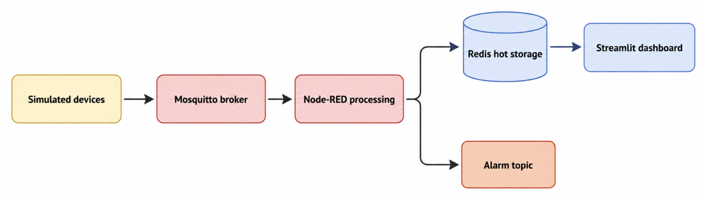
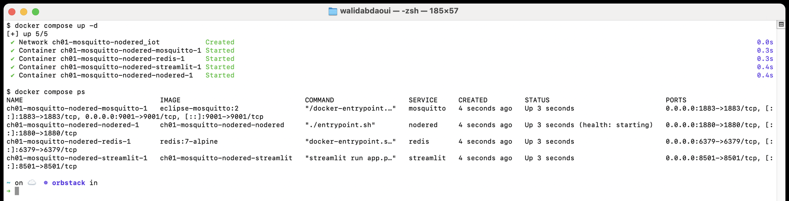
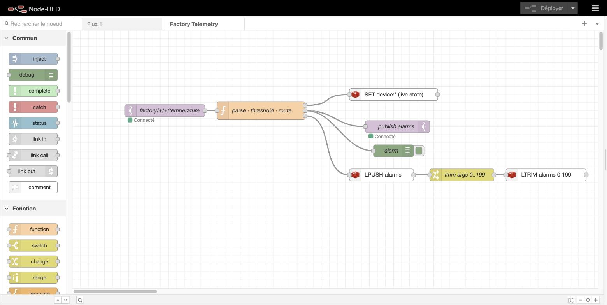
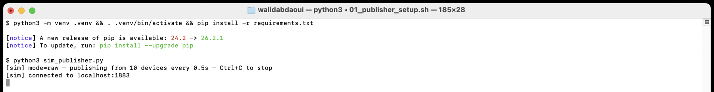
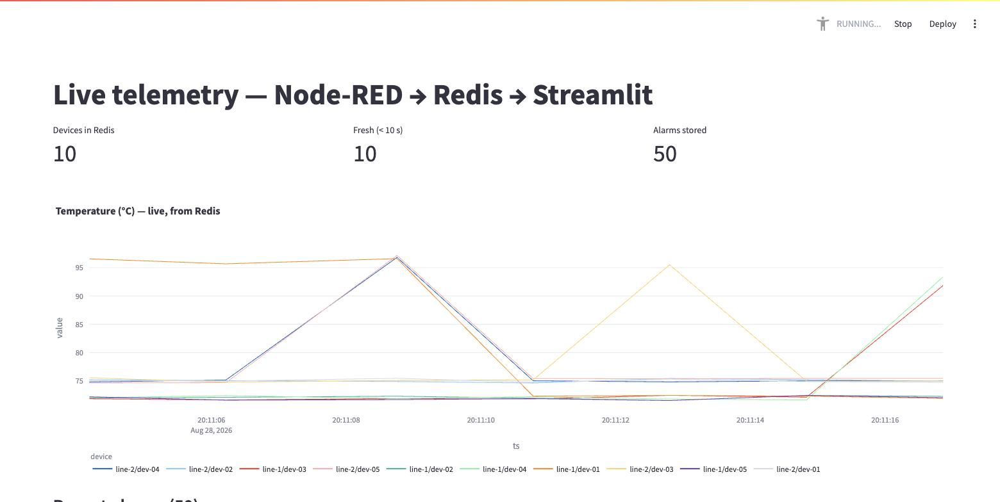
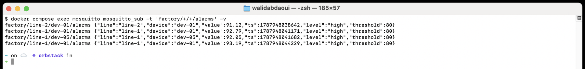

# Lab 1: Stand Up a Working IoT Platform in 60 Minutes

**Mission.** Stand up a small IoT platform on your own laptop: a broker, a stream processing flow, a hot storage layer, and a live dashboard, wired together with Docker Compose. Simulated devices publish temperature telemetry over MQTT, Node-RED parses it and checks it against a threshold, Redis holds the current state, and a Streamlit dashboard reads it back in real time. Everything runs locally, no cloud account needed.

## What you will learn

- How publish and subscribe messaging decouples a device from whoever consumes its data.
- How a flow based tool like Node-RED replaces a hand written parsing and routing script.
- Why a hot storage layer (Redis) between the producer and the consumer makes the architecture swappable.
- How to tell a broker outage, a publisher outage, and a stale dashboard apart just by watching how each one fails.

## Architecture



| Service | Role | Port |
| :---- | :---- | :---- |
| `mosquitto` | MQTT broker | 1883 (MQTT), 9001 (MQTT over WebSockets) |
| `redis` | Hot storage, live device state only | 6379 |
| `nodered` | Parses telemetry, checks the threshold, writes to Redis, republishes alarms | 1880 (editor) |
| `streamlit` | Dashboard, reads live state from Redis | 8501 |

Node-RED never talks to the dashboard directly. Redis is the shared state layer between them, so either side can be replaced without touching the other. Ten simulated devices across two production lines (`line-1`, `line-2`) publish a drifting temperature reading on `factory/<line>/<device>/temperature`, occasionally spiking above 80 C.

## What you need

Docker with Compose v2, and Python 3 for the simulated fleet. No physical hardware.

- **macOS:** [Tutorial T1](../tutorials/docker-startup.md) for Docker Desktop. Python 3 ships with macOS, or `brew install python3`.
- **Debian/Ubuntu:** `sudo apt install python3 python3-venv`, plus [Tutorial T1](../tutorials/docker-startup.md).
- **Windows:** run this lab from WSL2's Ubuntu terminal ([Tutorial T1](../tutorials/docker-startup.md#a-note-for-windows-readers-which-shell-to-run-the-labs-in)), then follow the Debian/Ubuntu step inside it.

## Procedure

Every command below was run and verified on a real machine, including every screenshot.

### 1. Start the platform

```sh
cd ch01-mosquitto-nodered
docker compose up -d
docker compose ps
```

Four services come up: Mosquitto, Redis, Node-RED, Streamlit. Nothing is publishing yet, and the flow has not been loaded.



### 2. Import the Node-RED flow

Open `http://localhost:1880/`. Menu (top right), Import, select `nodered-flows/factory-flow.json`, Deploy.

The flow subscribes to `factory/+/+/temperature`, parses each message, checks it against an 80 C threshold, writes the live value to Redis as `device:<line>/<device>`, and republishes an alarm whenever the threshold is crossed.



### 3. Run the simulated fleet

```sh
cd publisher
python3 -m venv .venv && . .venv/bin/activate
pip install -r requirements.txt
python3 sim_publisher.py              # raw mode, the default
```

Ten devices start publishing immediately. Two modes, selected by an argument or the `PUBLISH_MODE` environment variable:

- **Raw mode** (`python3 sim_publisher.py`) sends every reading.
- **Filtered mode** (`python3 sim_publisher.py filtered`) sends only anomalies plus a periodic summary, roughly 99 percent less traffic.



### 4. Verify the pipeline

Open `http://localhost:8501/`. Temperature curves update continuously, and alarms appear as soon as a device crosses 80 C.



In a second terminal, watch the alarm stream directly:

```sh
docker compose exec mosquitto mosquitto_sub -t 'factory/+/+/alarms' -v
```



The full pipeline is now live: device, MQTT, Node-RED, Redis, dashboard.

### 5. Break it on purpose

Run these with the stack still up.

- **Lower the threshold.** Edit the `80` in the Node-RED function node to `60`, redeploy. Alarms flood instantly. Set it back to `80` and redeploy.
- **Stop the publisher.** `Ctrl-C` it. The dashboard freezes on its last known values instead of erroring out, Redis still holds the last state.
- **Stop Mosquitto.** `docker compose stop mosquitto`. Node-RED loses its connection, then reconnects on its own once you `docker compose start mosquitto`, no restart needed.
- **Switch to filtered mode.** Restart the publisher with `python3 sim_publisher.py filtered` and compare how much quieter the alarm stream gets for the same anomalies.

### 6. Tear down

```sh
docker compose down
```

## What this proves

Publish and subscribe means no device has to know who is consuming its data, and no consumer has to know how many devices exist. Redis sitting between Node-RED and the dashboard is what makes either side replaceable: stopping the publisher only freezes the data, stopping the broker only breaks ingestion and recovers on its own, and neither failure spreads further than the layer that actually broke.

## Results checklist

- [ ] Live telemetry visible in the Streamlit dashboard
- [ ] Redis continuously updated with device state (`docker compose exec redis redis-cli KEYS 'device:*'`)
- [ ] Alarms published over MQTT and visible via `mosquitto_sub`
- [ ] Automatic reconnection after a broker restart
- [ ] Visibly reduced traffic when filtered mode is enabled

## Test

```sh
./tests/smoke.sh              # fast structural check, no images pulled
FULL=1 ./tests/smoke.sh       # full check: stack up, flow deployed, telemetry verified, teardown
```

## Troubleshooting

| Symptom | Cause | Fix |
| :---- | :---- | :---- |
| Port `1883`, `1880`, `6379`, or `8501` already in use | Another stack, or a local broker or Redis, is still running | `docker compose down` in the other project first, or check what is bound: `lsof -i :1883` |
| Node-RED flow shows no data after import | Flow not deployed, or the publisher is not running yet | Click Deploy after import. Confirm `sim_publisher.py` is running and printing lines. |
| Streamlit dashboard is blank or stuck | `REDIS_HOST` or `REDIS_PORT` mismatch, or Redis not yet healthy | `docker compose ps redis`. `docker compose logs streamlit`. |
| No alarms ever appear | Threshold (80 C) never crossed, or the flow is not deployed | Baselines are 72 C and 75 C with drift. Give it a minute, or lower the threshold to see alarms immediately. |
| `pip install` fails on `paho-mqtt` | Old `pip`, or no network access | `python3 -m pip install --upgrade pip` first. Pure Python, no compiler needed. |
| Publisher connects but Redis never fills (`KEYS device:*` is empty) | Node-RED flow not imported or deployed, or Mosquitto not reachable from the `nodered` container | Reimport the flow. Check `docker compose logs nodered` for MQTT connection errors. |
| `docker compose up` fails building `nodered` or `streamlit` | Stale image cache after an earlier failed build | `docker compose build --no-cache nodered streamlit` |

## Going further

- Add an eleventh device on a third production line, confirm the dashboard and Redis pick it up with no code changes.
- Replace the fixed 80 C threshold with a per-device value stored in Redis, and have Node-RED read it instead of hard coding it.
- Add a second consumer of the same Redis state, a second dashboard, or a script that emails when an alarm fires, without touching Node-RED or the publisher.
- Measure the actual bandwidth difference between raw and filtered mode with `docker stats` or a packet capture on the loopback interface.
