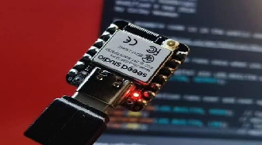
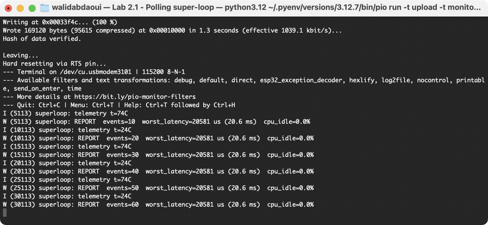
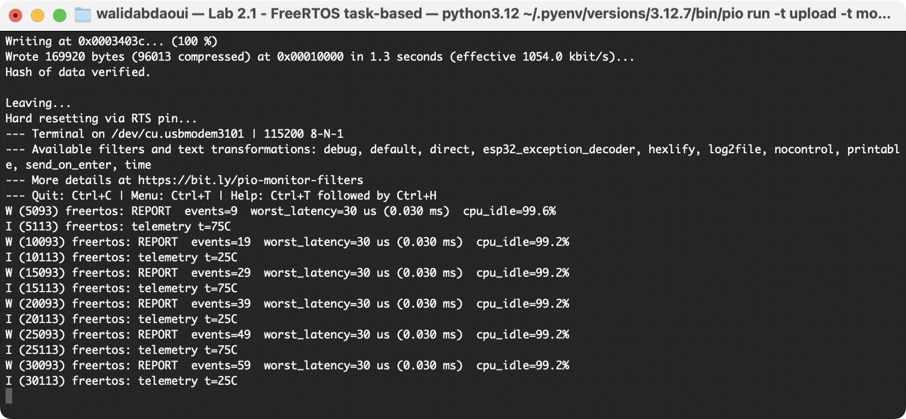
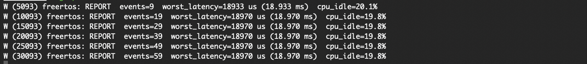
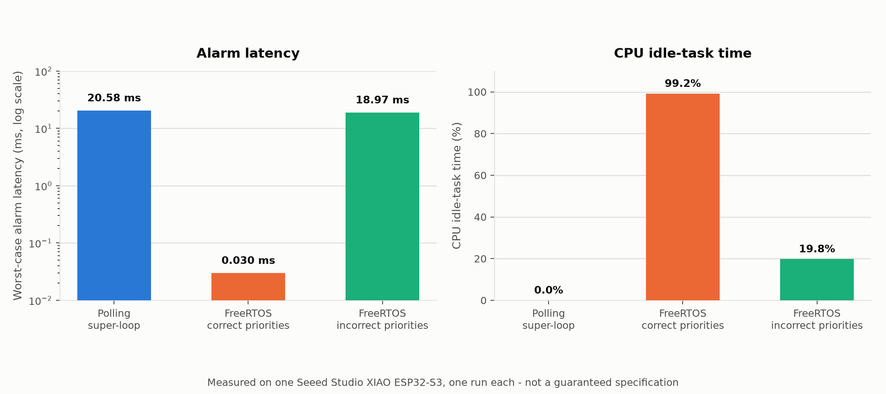

# Lab 2: Super-loop vs FreeRTOS Scheduling

**Mission.** Flash the same workload to a real ESP32-S3 three ways: a polling super-loop, then FreeRTOS tasks, then the same FreeRTOS tasks with priorities set wrong on purpose. Measure what changes each time, on real hardware, how scheduling architecture alone changes alarm response latency by roughly three orders of magnitude, and how getting task priorities wrong gives most of that back.

## What you will learn

- Why a busy polling loop and an RTOS running the identical workload produce worst-case response times that differ by three orders of magnitude.
- What CPU idle-task time actually measures, a proxy for a power-saving opportunity, not a measurement of power itself.
- How to read a task priority table and predict which task wins when two become ready at once.
- The difference between incorrect priority assignment (this lab) and priority inversion (which needs a shared resource this lab does not have).

## What you need

Only a Seeed Studio XIAO ESP32-S3 and its USB-C cable. No power profiler, no logic analyser. Both firmware builds measure themselves and print worst-case alarm latency and CPU idle time over the USB serial monitor.

- **First time flashing an ESP32-S3?** [Tutorial T2: ESP32-S3 startup](../tutorials/esp32-s3-startup.md).
- **Prefer raw ESP-IDF over PlatformIO?** [Tutorial T3: FreeRTOS for ESP32-S3 startup](../tutorials/freertos-esp32-s3-startup.md).



## Quick start: no `idf.py` install required

Each project folder ships a `platformio.ini`, so [PlatformIO](https://platformio.org/) builds and flashes it with no ESP-IDF toolchain to install or activate.

```bash
pip install platformio
```

If your board does not auto-detect, add `--upload-port /dev/tty.usbmodemXXXX` (macOS/Linux) or `--upload-port COMx` (Windows). Find the port with `pio device list`.

Already have ESP-IDF v5.2+ sourced (`. $IDF_PATH/export.sh`)? Use `idf.py set-target esp32s3 && idf.py build flash monitor` instead of `pio` in any command below.

## Procedure

The same workload is implemented three ways, and two numbers are measured each time: worst-case alarm response latency, and how much time the idle task gets to run.

1. `superloop/`, a polling `while(1)` loop, no OS scheduling primitives. It still links against ESP-IDF and FreeRTOS, but its own control flow never calls `vTaskDelay`, never yields.
2. `freertos/`, the identical workload split across four pre-emptible tasks with correct priorities.
3. The same tasks, with priorities swapped so a low-urgency task outranks a time-critical one.

Both builds use a periodic `esp_timer` (500 ms) as the alarm event, close enough to a real interrupt for this comparison, not ISR-level dispatch. Workload in all three runs: sensor read every 100 ms, alarm every 500 ms, a 40 ms blocking telemetry operation every 5 s.

### Part 1: polling super-loop

```bash
cd superloop
pio run -t upload -t monitor      # build, flash, and open the serial monitor in one step
```

Flash and monitor together. A separate `pio device monitor` connection opened later can trigger its own reset and a misleadingly high first reading. Every 5 seconds the firmware prints:

```
REPORT  events=10  worst_latency=20581 us (20.6 ms)  cpu_idle=0.0%
```

`cpu_idle` at 0.0% is expected, the loop never stops spinning between chores, so the idle task never runs. Let it print a few cycles to confirm the number is stable. `Ctrl-C` to leave the monitor.



### Part 2: FreeRTOS tasks

| Task | Priority | Function |
| :---- | ----: | :---- |
| `acquire_task` | 5 | Sensor read every 100 ms |
| `alarm_task` | 7 | Receives alarm events over a queue |
| `telemetry_task` | 3 | Blocking 40 ms telemetry operation every 5 s |
| `report_task` | 10 | Prints the report line |

`alarm_task` outranks `telemetry_task`, so it pre-empts the blocking operation instead of waiting behind it. Every task blocks between chores, so the idle task gets to run.

```bash
cd ../freertos
pio run -t upload -t monitor
```

```
REPORT  events=9  worst_latency=30 us (0.030 ms)  cpu_idle=99.2%
```

Same chip, same workload as Part 1, only the scheduling model changed. Worst-case latency dropped from tens of milliseconds to tens of microseconds, CPU idle rose from 0% to over 99%. That is task separation and pre-emption at work, not FreeRTOS by itself, Part 3 shows the same tasks with a very different result once the priorities are wrong.



### Part 3: incorrect priority assignment

This is incorrect priority assignment, not priority inversion, there is no shared resource like a mutex here. In `freertos/main/main.c`, change three values.

| What | From | To |
| :---- | ----: | ----: |
| `alarm_task` priority | 7 | 1 |
| `telemetry_task` priority | 3 | 9 |
| `TELEMETRY_PERIOD_MS` | 5000 | 50 |

`telemetry_task` now runs more often than `alarm_task` and outranks it, so its blocking 40 ms operation, now 80% of every 50 ms cycle, repeatedly delays alarm processing. Reflash:

```bash
pio run -t upload -t monitor
```

```
REPORT  events=9  worst_latency=18933 us (18.933 ms)  cpu_idle=20.1%
```

Latency rose back to the tens-of-milliseconds range, CPU idle dropped from over 99% to roughly 20%. The tasks and pre-emption mechanism are unchanged from Part 2, only the priorities and telemetry period changed. Set the three values back before moving on.



### Results

| Implementation | Worst alarm latency | CPU idle |
| :---- | ----: | ----: |
| Polling super-loop | 20.6 ms | 0.0% |
| FreeRTOS, correct priorities | 0.030 ms | 99.2% |
| FreeRTOS, incorrect priorities | 18.97 ms | 19.8% |

Measured on one Seeed Studio XIAO ESP32-S3, one run each, illustrative, not a guaranteed spec. Re-run on your own board before treating any single number as representative. CPU idle time is not a direct power measurement, low-power operation needs power management and sleep configuration on top of it.



## Test

```bash
./tests/smoke.sh              # fast structural check
FULL=1 ./tests/smoke.sh       # also compiles both firmware projects
```

## Troubleshooting

| Symptom | Cause | Fix |
| :---- | :---- | :---- |
| `pio run -t upload` can't find the board | Wrong or no `--upload-port` | `pio device list` to find it. macOS: `/dev/cu.usbmodemXXXX`. Linux: `/dev/ttyACM0` or similar. Windows: `COMx`. |
| `Permission denied` opening the serial port | Not in the right group (Linux), or another program has the port open | Linux: `sudo usermod -aG dialout $USER`, then log out and back in. Otherwise close any other monitor or IDE using the port. |
| First `pio run` takes several minutes | PlatformIO is downloading the ESP-IDF toolchain, one time | Normal. Subsequent builds take seconds. |
| Monitor shows garbled text or nothing | Wrong baud rate, or the board reset mid-connect | Confirm `--baud 115200`. First lines cut off right after a reset is expected. |
| `worst_latency` looks anomalously high on the first report | A standalone `pio device monitor` opened separately from the flash can trigger its own reset with different timing | Always flash and monitor together: `pio run -t upload -t monitor`. Reflash if a number still looks off. |
| `Flash memory size mismatch detected. Expected 8MB, found 2MB` | Board variant reports a smaller flash size than `sdkconfig.defaults` assumes | Cosmetic warning on most XIAO ESP32-S3 revisions. Safe to ignore. |
| `idf.py` raw path: `IDF_PATH` not set | Environment not sourced | `. $IDF_PATH/export.sh` before any `idf.py` command, or use the PlatformIO path instead. |
| Part 3 numbers do not change from Part 2 | The three edits in `freertos/main/main.c` were not saved or not reflashed | Confirm the file was saved. Check with `grep xTaskCreate main/main.c`. |

## Limitations

- `esp_timer` dispatch, not ISR-level or hardware-timer dispatch.
- Single core (`CONFIG_FREERTOS_UNICORE=y`), the results say nothing about dual-core scheduling.
- `read_temperature_c()` is a stub ramp, not a real sensor read.
- Reported numbers are from one run on one board, expect some variation.

## Going further

- Enable tickless idle and automatic light sleep (`CONFIG_PM_ENABLE`), measure the effect on `cpu_idle` and, with a power profiler, on actual current draw.
- Add a fourth, inference-style task, find the priority it needs to avoid delaying the alarm path.
- Port the FreeRTOS build to Zephyr and compare.
- Switch the event source to a GPTimer alarm in ISR dispatch mode and see how much the latency floor drops.
