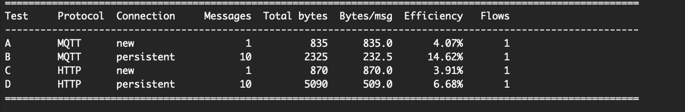
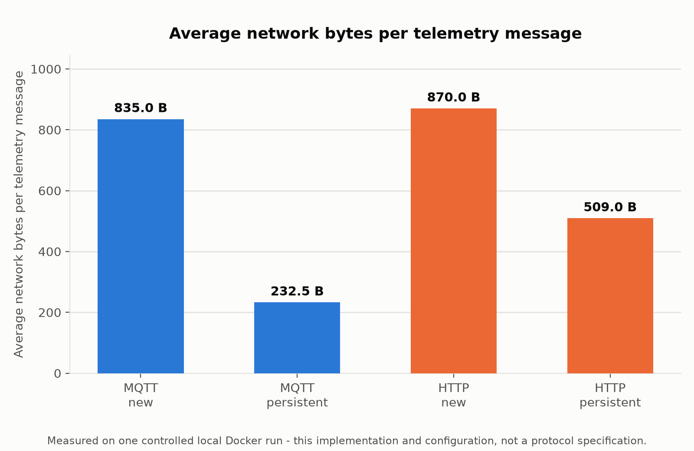
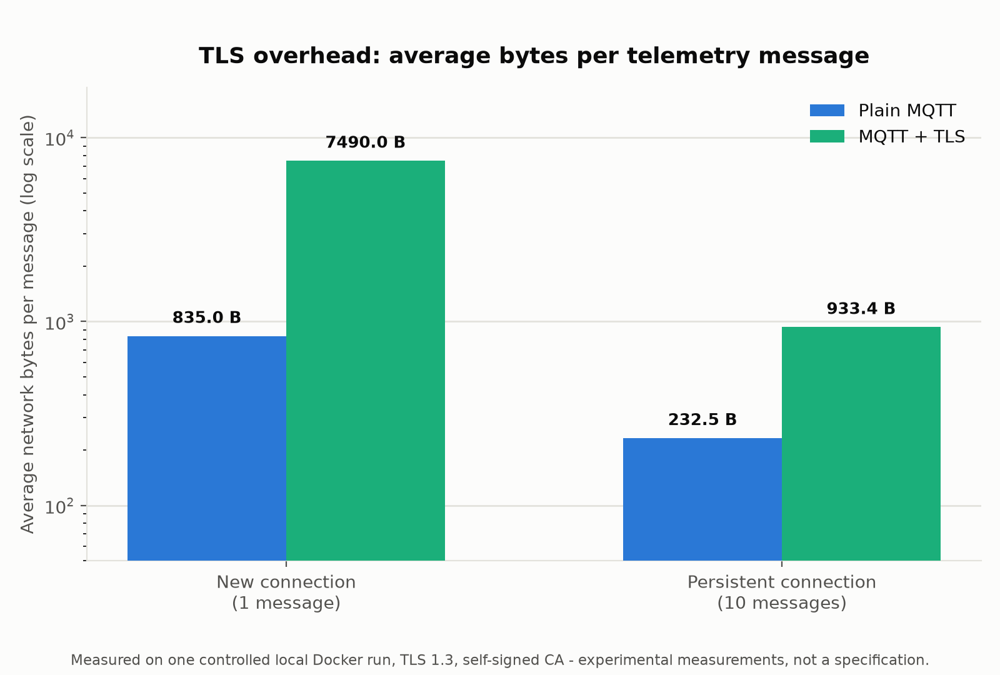
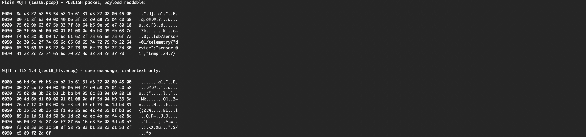

# Lab 3: Measuring Protocol and Connection Overhead

**Mission.** Send the same 34-byte telemetry payload over MQTT and HTTP, new connection versus persistent connection, and measure exactly how many bytes each configuration costs on the wire, from real packet captures. Radio and link layers are intentionally out of scope, so the comparison measures application protocol and connection behavior only, not one specific wireless technology.

The exact byte counts are a measurement of this implementation, not a specification of MQTT, HTTP, or TLS. The shape of the result, reuse helps, TLS costs more per new connection than per reused one, is the transferable lesson, the digits are not.

## What you will learn

- How to define "bytes on the wire" precisely enough that a measurement is reproducible.
- Why connection reuse reduces the average network cost per message, and by how much, for this configuration.
- Why TLS adds a fixed cost to connection establishment, and why reuse matters more once that cost is amortized.
- How to read a packet capture's framing well enough to tell a TCP handshake apart from application payload.

## What you need

Docker with Compose v2. Nothing else. The MQTT and HTTP client, `tcpdump`, and the analyzer all run inside the `client` container, no host Python environment, no host capture permissions.

## Architecture


Every test transmits the exact same payload:

```python
PAYLOAD = b'{"device":"sensor-01","temp":23.7}'
assert len(PAYLOAD) == 34
```

The four experiments:

| Test | Protocol | Connection behavior | Messages |
| :---- | :---- | :---- | ----: |
| A | MQTT QoS 0 | New TCP connection | 1 |
| B | MQTT QoS 0 | Persistent TCP connection | 10 |
| C | HTTP POST | New TCP connection | 1 |
| D | HTTP POST | Persistent TCP connection | 10 |

MQTT is 3.1.1, QoS 0, topic `lab/sensor-01/telemetry`. HTTP is HTTP/1.1 with a minimal fixed header set and a `204 No Content` response with no `Date` or `Server` header, both stripped so the byte count reflects HTTP/1.1 itself, not one server implementation's extra headers.

**What "bytes" means:** the sum of IP packet lengths observed in both directions for the connection under test, link-layer headers excluded. Not the raw frame size `tcpdump` prints by default, and not radio traffic or airtime, this lab measures neither. Both directions count because TCP acknowledgements, HTTP responses, and MQTT's own CONNACK and DISCONNECT are part of what the connection costs. Three numbers are reported per test and never collapsed into one: total network bytes, average bytes per message (`total / message_count`), and payload efficiency (`message_count x 34 / total x 100`).

Where the capture allows reliable classification, results also break down by TCP establishment, protocol setup (MQTT CONNECT/CONNACK, zero for HTTP), telemetry exchange, and TCP termination. This breakdown is skipped for TLS captures, TLS 1.3 wires handshake and application data with the same outer record type, so the boundary is not reliably recoverable from the capture alone.

## Procedure

```bash
cd ch03-mqtt-vs-http-cost
docker compose up -d --build
python3 run_all_tests.py
```

`run_all_tests.py` runs on the host with no pip dependencies of its own, everything happens through `docker compose exec client ...`. For each test it starts `tcpdump` inside the client container, runs the matching client invocation, analyzes the pcap, then prints the comparison table, verifies Tests B and D really used one TCP connection each, and saves `results/results.json` and `results/results.csv`.

Regenerate this lab's own figures from those results (`--figures` needs `matplotlib` on the host):

```bash
python3 run_all_tests.py --figures
```

Prefer to drive a capture by hand? `mosquitto` and `http_server` also publish to the host (1883, 8080):

```sh
tcpdump -i lo0 -w captures/testA.pcap 'tcp port 1883 and host 127.0.0.1'   # lo0 macOS, lo Linux
python3 client/telemetry_client.py --protocol mqtt --connection new --count 1 --host 127.0.0.1
```

`analyze_capture.py` reads any pcap `tcpdump`, `tshark`, or Wireshark writes. Wireshark's own Statistics, then Conversations, then TCP panel reports the same totals for the GUI path.

## Results

| Test | Protocol | Connection | Messages | Total network bytes | Average bytes/message | Payload efficiency |
| :---- | :---- | :---- | ----: | ----: | ----: | ----: |
| A | MQTT | new | 1 | 835 | 835.0 | 4.07% |
| B | MQTT | persistent | 10 | 2,325 | 232.5 | 14.62% |
| C | HTTP | new | 1 | 870 | 870.0 | 3.91% |
| D | HTTP | persistent | 10 | 5,090 | 509.0 | 6.68% |

Measurements from one controlled local run, not protocol specifications.





Reusing a connection amortizes setup and teardown across messages: Test A's single message costs 835 bytes end to end, Test B's ten messages average 232.5 bytes once the connection is already open, 172 bytes of TCP establishment and 262 of termination paid once instead of ten times. With a persistent connection, MQTT costs less per message than HTTP here, 232.5 versus 509.0 bytes, because an MQTT PUBLISH after CONNECT is close to just topic plus payload, while every HTTP request still carries a method line, a path, and a full header block, keep-alive or not.

## Optional TLS extension, about 10 to 15 minutes

Isolates the TLS variable by comparing MQTT only, plaintext against TLS, new connection against persistent.

```sh
./certs/gen-certs.sh
docker compose -f docker-compose.yml -f docker-compose.tls.yml up -d
python3 run_all_tests.py --tls   # repeats only Tests A and B, over TLS
```

TLS 1.3, a self-signed CA, server authentication only, no client certificates (mutual TLS with per-device certificates is [Lab 4](../ch04-pki-security/README.md)).

| Test | Protocol | Connection | Messages | Total network bytes | Average bytes/message | Payload efficiency |
| :---- | :---- | :---- | ----: | ----: | ----: | ----: |
| A | MQTT | new | 1 | 835 | 835.0 | 4.07% |
| A+TLS | MQTT + TLS | new | 1 | 7,490 | 7,490.0 | 0.45% |
| B | MQTT | persistent | 10 | 2,325 | 232.5 | 14.62% |
| B+TLS | MQTT + TLS | persistent | 10 | 9,334 | 933.4 | 3.64% |



A new TLS connection costs roughly nine times a plaintext one here, mostly the certificate exchange and key negotiation. Reused, that cost amortizes down to about four times the plaintext persistent cost rather than nine. TLS is not free, but connection reuse recovers most of what a new-connection-per-message design would lose.

Rather than infer encryption from a failed text search, the lab captures the same PUBLISH exchange twice, once plaintext, once over TLS, and shows the actual bytes.



## Questions

1. Why does connection reuse reduce the average traffic per telemetry message?
2. Why does HTTP/1.1 generate more application overhead than MQTT in this experiment?
3. How would increasing the telemetry payload size affect payload efficiency?
4. Why is TLS connection reuse particularly important for devices sending frequent small messages?

## Key takeaways

- Protocol overhead includes more than the application payload. Connection establishment, framing, acknowledgements, and security all contribute.
- Connection lifetime affects efficiency more than protocol choice alone. Reusing TCP and TLS connections cuts the average overhead of frequent small messages.
- Protocol measurements are configuration dependent. Version, headers, topic length, and implementation all shift the numbers.
- Network traffic is not power consumption. Evaluating energy needs measurements on the target hardware and radio.

## Test

```bash
./tests/smoke.sh              # fast structural check
FULL=1 ./tests/smoke.sh       # brings the stack up, runs the real lab, verifies connection reuse
```

## Troubleshooting

| Symptom | Cause | Fix |
| :---- | :---- | :---- |
| `services did not become reachable in time` | `client` tried to reach `mosquitto` or `http_server` before the stack was up | `docker compose up -d --build` first, give it a few seconds, `docker compose ps` should show all three `running` |
| Port `1883` or `8080` already in use | Another lab's stack (Lab 1, Lab 4 also use 1883) is still running | `docker compose down` in the other lab first, or check what is bound: `lsof -i :1883` |
| `tcpdump` inside `client` exits immediately, or captures are empty | `cap_add: [NET_RAW, NET_ADMIN]` was stripped, some restricted/rootless Docker setups refuse extra capabilities | Confirm `docker-compose.yml`'s `client` service still has both `cap_add` entries, this lab needs a normal Docker Engine or Desktop |
| `run_all_tests.py --tls` fails to connect on port 8883 | Certificates never generated, or the TLS overlay never brought up | `./certs/gen-certs.sh`, then `docker compose -f docker-compose.yml -f docker-compose.tls.yml up -d` |
| `WARNING: Test B/D used N TCP connections, expected 1` | A real reconnect happened mid-run, broker restart, keep-alive timeout under load | Do not run other `docker compose` commands concurrently, re-run in isolation |
| `run_all_tests.py --figures` fails with `ModuleNotFoundError: No module named 'matplotlib'` | Figure regeneration runs on the host, needs its own environment | `pip install matplotlib numpy` on the host, or skip `--figures`, it does not affect the lab's own measurements |

## Limitations

- Byte counts are specific to this implementation (Mosquitto 2.x, Python's `http.server`, `paho-mqtt` 1.x, Alpine's TCP stack) and this local network path, a different broker, library, or real network will shift the numbers.
- The protocol breakdown assumes each control packet fits within one or two TCP segments with a recognizable marker, true for this lab's small, low-rate messages, not a general guarantee under loss, reordering, or much larger payloads.
- The TLS extension measures server-authenticated TLS only, not mutual TLS or certificate-based device identity.
- This lab measures network bytes, not power, airtime, or latency under real radio conditions.

## Going further

- Vary the payload size and recompute payload efficiency for all four tests. Connection setup is fixed, so efficiency should rise with payload size.
- Add MQTT QoS 1 or 2 and measure the extra PUBACK, PUBREC, PUBREL, PUBCOMP traffic against this lab's QoS 0 baseline.
- Point `telemetry_client.py` at a broker or HTTP server outside this lab's Docker network, a real device on the LAN, and compare.
- Swap `http_server/server.py` for a production HTTP server and see how much of HTTP's overhead here was Python's stdlib specifically versus HTTP/1.1 itself.
