# Lab 4: Build and Break an IoT Trust Chain

**Mission.** Build a small PKI, a Root CA and an Intermediate CA, issue per-device certificates, and configure an MQTT broker for mutual TLS. Then test the trust boundary: connect without a certificate, with an untrusted one, into another device's topics, to the wrong hostname, and with a certificate that was trusted a moment ago until it got revoked. No physical hardware required.

## What you will learn

- How a Root CA and an Intermediate CA form a certificate trust hierarchy.
- How a device gets an X.509 certificate without exposing its private key (a CSR proves possession, nothing more).
- How mutual TLS authenticates both the broker and the device.
- Why MQTT authorization is a separate check from TLS authentication.
- How certificate revocation invalidates an identity before expiry, and why propagation and decision are different problems.
- Why server name verification is a separate check from certificate trust.

## Time budget

| Phase | Time |
| :---- | ---: |
| Build the trust hierarchy (Parts 1-4) | 20 min |
| Verify a valid mTLS connection (Part 5) | 5 min |
| Break authentication (Part 6) | 10 min |
| Verify server identity (Part 7) | 5 min |
| Break authorization (Part 8) | 15 min |
| Revoke the identity (Parts 9-10) | 10 min |
| **Total** | **65 min** |

## Architecture

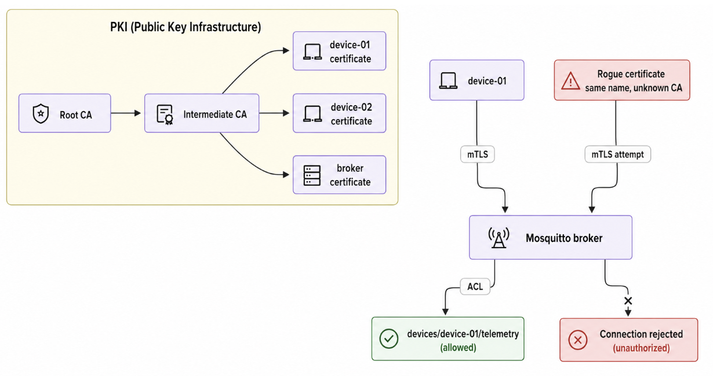

A single, flat CA that signs every device certificate directly would work, but its key has to stay online for every enrollment, and compromising it once makes every certificate it ever issued suspect. Splitting the CA in two limits that exposure: the **Root CA** signs exactly one thing here, the Intermediate CA's certificate, and would stay offline in production. The **Intermediate CA** does the daily work, signing devices and the broker, and can be replaced without re-trusting the fleet.

## Test matrix

| Test | Certificate presented | Trust | Authorization | Expected result |
| :---- | :---- | :---- | :---- | :---- |
| Valid device | device-01 | Trusted | Own topic | Accept |
| No certificate | None | N/A | N/A | Reject |
| Rogue device | Rogue device-01 | Untrusted | N/A | Reject |
| Cross-device publish | device-01 | Trusted | device-02's topic | Deny |
| Wrong server name | device-01 | Trusted | N/A | Reject at the endpoint check |
| Revoked device | device-01 | Trusted, but revoked | N/A | Reject |
| Unaffected device | device-02 | Trusted | Own topic | Accept |

## What you need

Docker with Compose v2, OpenSSL, and `mosquitto-clients` (`mosquitto_pub`/`mosquitto_sub`). No physical hardware, the CLI clients stand in for the device.

- **macOS:** `brew install mosquitto` for the clients. OpenSSL and Docker from [Tutorial T1](../tutorials/docker-startup.md).
- **Debian/Ubuntu:** `sudo apt install mosquitto-clients openssl`.
- **Windows:** run from WSL2's Ubuntu terminal ([Tutorial T1](../tutorials/docker-startup.md#a-note-for-windows-readers-which-shell-to-run-the-labs-in)).

Tested with Docker Compose v2, OpenSSL 3.x, Mosquitto 2.1.2 (pinned in `docker-compose.yml`). Recent equivalents should work, though OpenSSL's exact wording may differ.

## Layout

```
pki/
  root-ca.cnf, intermediate-ca.cnf   OpenSSL CA configs
  01-init-root-ca.sh                 create the offline Root CA
  02-init-intermediate-ca.sh         create and sign the Intermediate CA, publish an empty CRL
  03-issue-cert.sh <name> <client|server> [SAN]   issue a device or server cert
  04-revoke-cert.sh <name>           revoke a cert, republish the CRL
  05-issue-rogue-cert.sh             build a cert our PKI never issued (rejection demo)
  06-sync-broker-certs.sh            copy what Mosquitto needs into ../certs/
mosquitto/config/                    mosquitto.conf (mTLS + crlfile), acl.conf (per-device pub/sub)
docker-compose.yml                   single-container Mosquitto broker, pinned image version
tests/smoke.sh                       FULL=1 runs the entire lab end to end
```

## Procedure

```sh
cd ch04-pki-security
chmod +x pki/*.sh
```

Every command below was run and verified on a real machine, the output blocks are real. Yours will differ only in dates and machine-specific paths.

### Part 1: build the Root CA

```sh
cd pki
./01-init-root-ca.sh
```

Generates a 4096-bit RSA key pair and self-signs a certificate over it, 20-year validity since a trust anchor is rotated far less often than a device certificate.

```
Root CA created: .../pki/root-ca/certs/ca.cert.pem
subject=O=AIoT Lab, CN=AIoT Lab Root CA
issuer=O=AIoT Lab, CN=AIoT Lab Root CA
```

Subject and issuer are identical, a self-signed certificate, the top of the trust hierarchy. Self-signing alone does not make it trusted, it becomes a trust anchor because it is explicitly provisioned into `--cafile` on every command below.

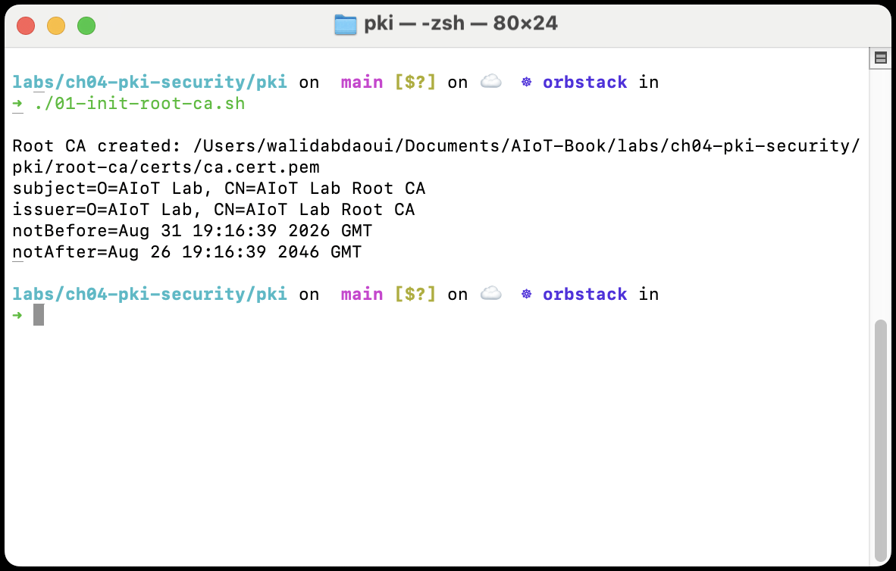

### Part 2: build the Intermediate CA

```sh
./02-init-intermediate-ca.sh
```

A second key pair, a CSR, and the Root CA signs it, the one signing operation the root performs anywhere in this lab. Also publishes an initial, empty CRL.

```
Intermediate CA created and signed by the root:
subject=O=AIoT Lab, CN=AIoT Lab Intermediate CA
issuer=O=AIoT Lab, CN=AIoT Lab Root CA
Initial (empty) CRL published: .../pki/intermediate-ca/crl/intermediate.crl.pem
```

`issuer=... Root CA` is the line to check, the intermediate's issuer is the root, not itself.

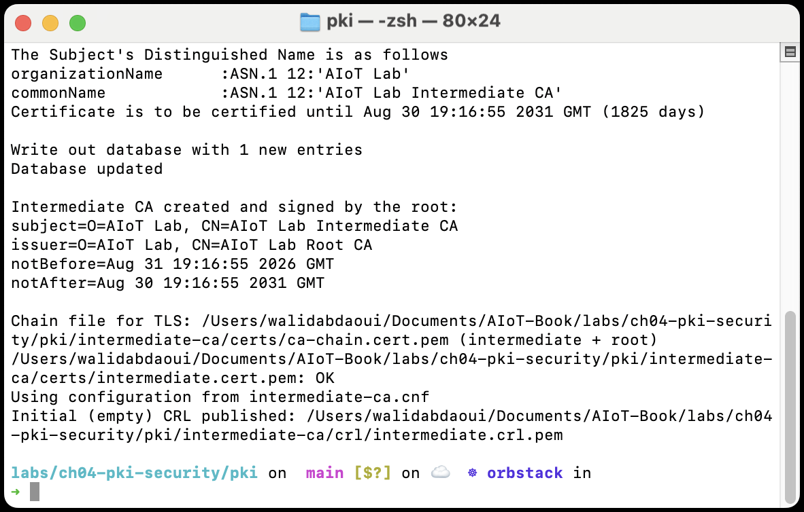

### Part 3: issue device and broker certificates

```sh
./03-issue-cert.sh device-01 client
./03-issue-cert.sh device-02 client
./03-issue-cert.sh broker server "DNS:mosquitto.local,DNS:localhost,IP:127.0.0.1"
```

The second argument sets extended key usage, `clientAuth` or `serverAuth`. The broker's certificate also carries the SAN list, the names a client's endpoint check may match it against, tested in Part 7. Key usage on every certificate here is `digitalSignature` only, TLS 1.3 needs nothing more.

```
Issued client cert for 'device-01':
subject=O=AIoT Lab, CN=device-01
issuer=O=AIoT Lab, CN=AIoT Lab Intermediate CA
```

Every leaf certificate's issuer is the Intermediate CA, never the root directly.

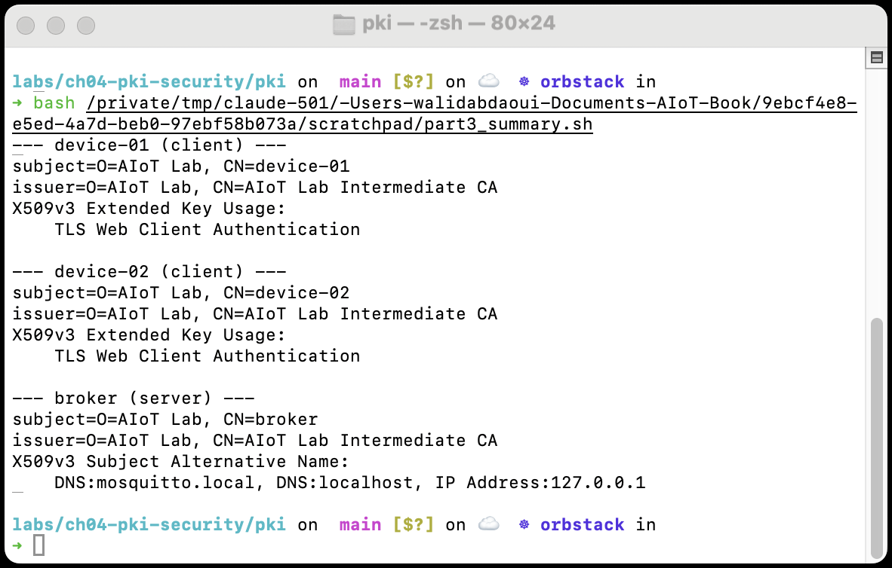

### Part 4: start the mTLS MQTT broker

```sh
./06-sync-broker-certs.sh
cd ..
docker compose up -d
```

Mosquitto never reads `pki/` directly, that directory also holds every CA's private key. This script copies only what the broker needs into `../certs/`: the chain (to validate incoming device certificates), the broker's own certificate concatenated with the intermediate (so a client holding only the root can build the path), its private key, and the CRL.

`docker compose ps` should show `lab04-mosquitto` as `Up`, listening on `8883`.

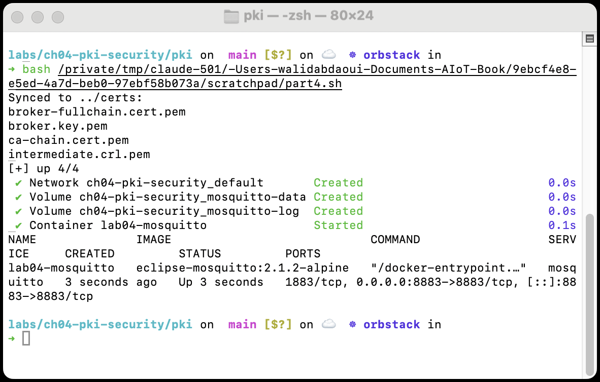

### Part 5: a valid mTLS connection

`device-01`'s certificate validates to the client's trust anchor, and it proves possession of the matching private key during the handshake.

```sh
mosquitto_sub -h localhost -p 8883 \
  --cafile pki/root-ca/certs/ca.cert.pem \
  --cert pki/device-01.cert.pem --key pki/device-01.key.pem \
  -t 'devices/device-01/telemetry/#' -C 1 &

sleep 1
mosquitto_pub -h localhost -p 8883 \
  --cafile pki/root-ca/certs/ca.cert.pem \
  --cert pki/device-01.cert.pem --key pki/device-01.key.pem \
  -t 'devices/device-01/telemetry/reading' -m '{"t":24.1}'
wait
```

`--cafile` points at the Root CA alone, not the chain bundle, on purpose, the broker supplies its own certificate plus the Intermediate CA's during the handshake, so the client builds the full path from the root it already trusts.

```
{"t":24.1}
```

The broker's log confirms `negotiated TLSv1.3` and `u'device-01'`, the certificate's CN mapped onto the MQTT username by `use_identity_as_username true`.

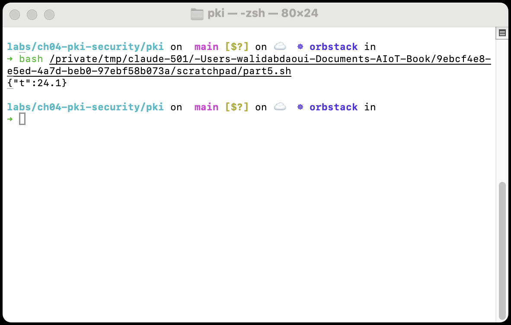

### Part 6: break authentication

**No certificate.** `require_certificate true` refuses the handshake itself.

```sh
mosquitto_sub -h localhost -p 8883 \
  --cafile pki/root-ca/certs/ca.cert.pem -t '#'
```

Hangs briefly, then `Error: The connection was lost`. The broker's log states it directly: `peer did not return a certificate`.

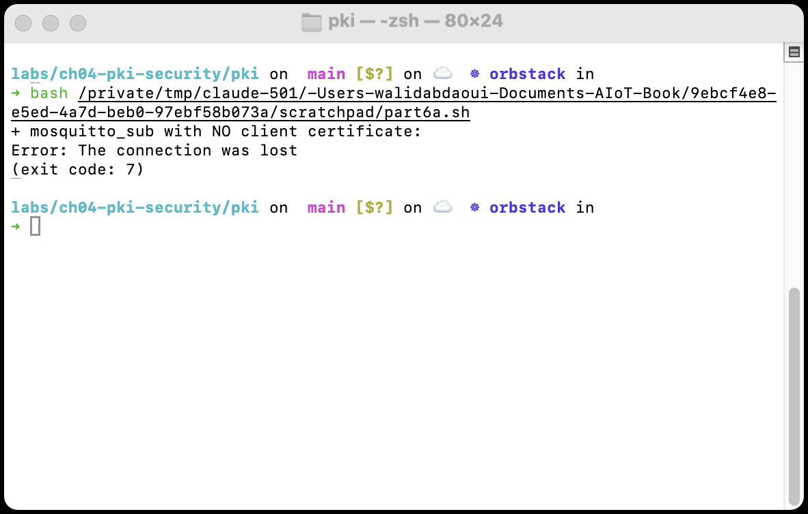

**Rogue certificate, same claimed identity, untrusted issuer.**

```sh
./05-issue-rogue-cert.sh
cd ..
mosquitto_sub -h localhost -p 8883 \
  --cafile pki/root-ca/certs/ca.cert.pem \
  --cert pki/rogue/device-01.cert.pem --key pki/rogue/device-01.key.pem \
  -t '#'
```

`05-issue-rogue-cert.sh` builds a throwaway CA, unrelated to this lab's own, and signs a certificate with the Common Name `device-01`. Same connection failure, but a different broker log line this time, `certificate verify failed`, not `peer did not return a certificate`. A certificate was offered, it just does not chain to a trust anchor either side configured. `CN=device-01` does not imply trusted device-01.

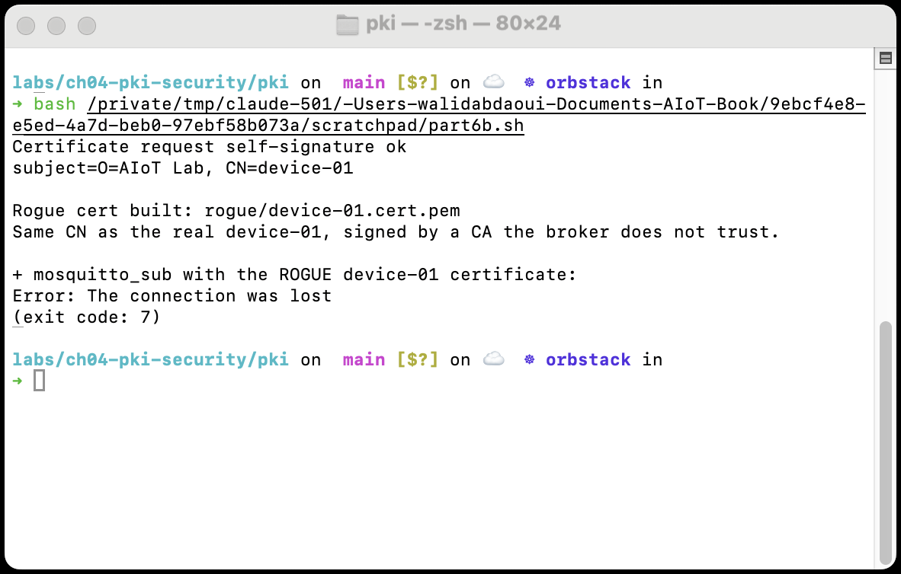

### Part 7: verify server identity

Certificate-path validation and endpoint identity are two different checks. This isolates the second from the first.

```sh
cd pki
openssl s_client -connect localhost:8883 \
  -CAfile root-ca/certs/ca.cert.pem -verify_hostname localhost \
  -cert device-01.cert.pem -key device-01.key.pem </dev/null
```

`localhost` is one of the names placed in the broker certificate's SAN back in Part 3, so this succeeds: `Verify return code: 0 (ok)`. Now the same connection against a name never listed there:

```sh
openssl s_client -connect localhost:8883 \
  -CAfile root-ca/certs/ca.cert.pem -verify_hostname wrong-broker.local \
  -cert device-01.cert.pem -key device-01.key.pem </dev/null
```

```
verify error:num=62:hostname mismatch
Verify return code: 62 (hostname mismatch)
```

Both connections used the same broker certificate and the same trusted root, certificate-path validation succeeded both times. Only the endpoint check differed, the same check that stops a certificate misissued for one host from being silently accepted for another.

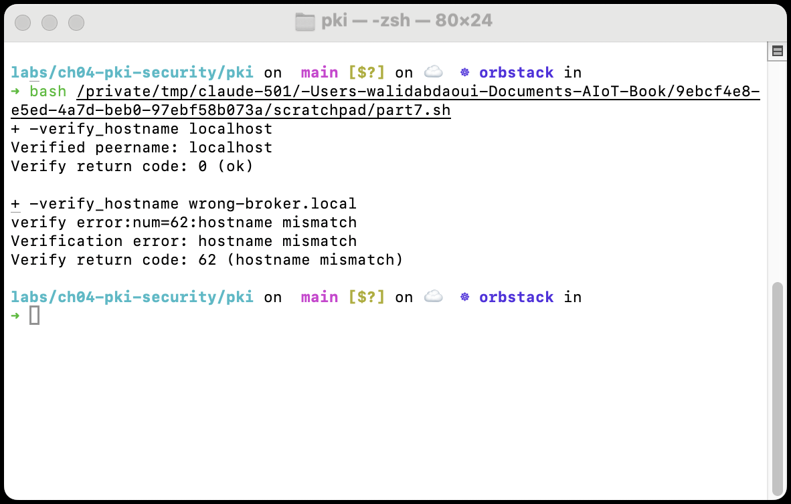

### Part 8: break authorization

**Own topic**, expected to succeed, `acl.conf`'s `pattern readwrite devices/%u/telemetry/#` expands `%u` to `device-01`, matching the topic:

```sh
cd ..
mosquitto_pub -h localhost -p 8883 \
  --cafile pki/root-ca/certs/ca.cert.pem \
  --cert pki/device-01.cert.pem --key pki/device-01.key.pem \
  -t 'devices/device-01/telemetry/reading' -m '{"t":24.3}'
```

**Another device's topic**, using the same certificate that just succeeded above. In one terminal, subscribe as `device-02`:

```sh
mosquitto_sub -h localhost -p 8883 \
  --cafile pki/root-ca/certs/ca.cert.pem \
  --cert pki/device-02.cert.pem --key pki/device-02.key.pem \
  -t 'devices/device-02/telemetry/#' -C 1
```

In another, publish onto `device-02`'s topic with `device-01`'s certificate:

```sh
mosquitto_pub -h localhost -p 8883 \
  --cafile pki/root-ca/certs/ca.cert.pem \
  --cert pki/device-01.cert.pem --key pki/device-01.key.pem \
  -t 'devices/device-02/telemetry/reading' -m '{"t":99.9}'
```

Both `mosquitto_pub` commands report success and exit 0, that is the point: MQTT QoS 0 gives no application-level acknowledgment of an ACL denial, just a silently dropped message. The proof is on the receiving side, `device-02`'s subscriber sees nothing, no matter how long you wait. `device-01`'s certificate validated to the trust anchor both times, authentication succeeded both times. The difference is entirely at the ACL, authentication and authorization are not the same check.

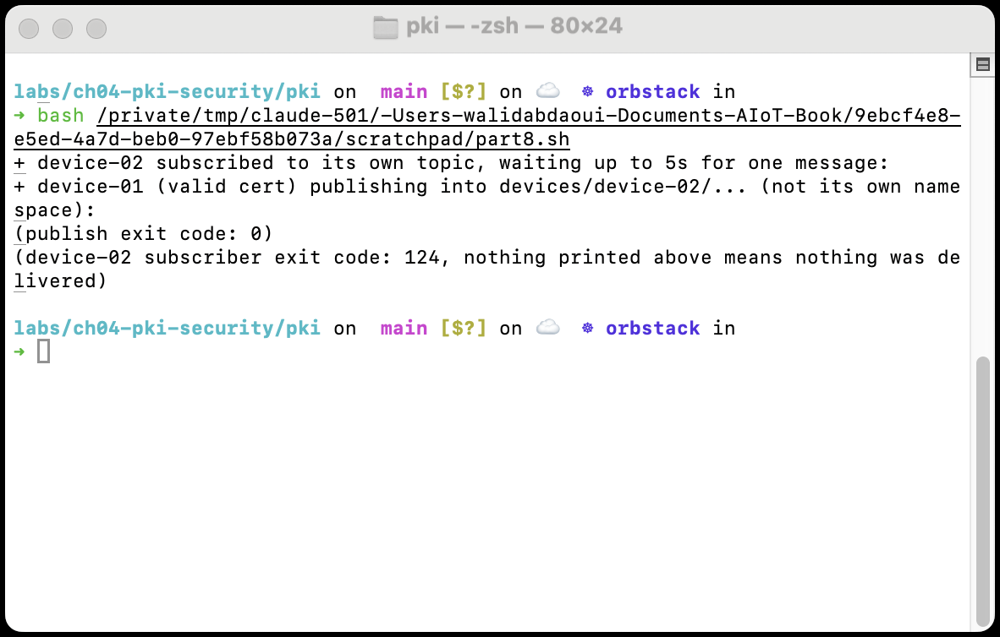

### Part 9: revoke device-01

```sh
cd pki
./04-revoke-cert.sh device-01
docker compose restart mosquitto
```

Marks the serial number revoked in the Intermediate CA's records, republishes the CRL, copies it into `../certs/`. `docker compose restart` is not optional, `crlfile` is read once at broker startup, so revocation has no effect until the broker restarts and re-reads it, decision and propagation are two different problems with two different latencies.

```sh
cd ..
mosquitto_sub -h localhost -p 8883 \
  --cafile pki/root-ca/certs/ca.cert.pem \
  --cert pki/device-01.cert.pem --key pki/device-01.key.pem \
  -t '#'
```

Same failure and the same `certificate verify failed` log line as the rogue certificate in Part 6. `device-01`'s certificate has not expired and its signature is still valid, but its serial number is now on the CRL.

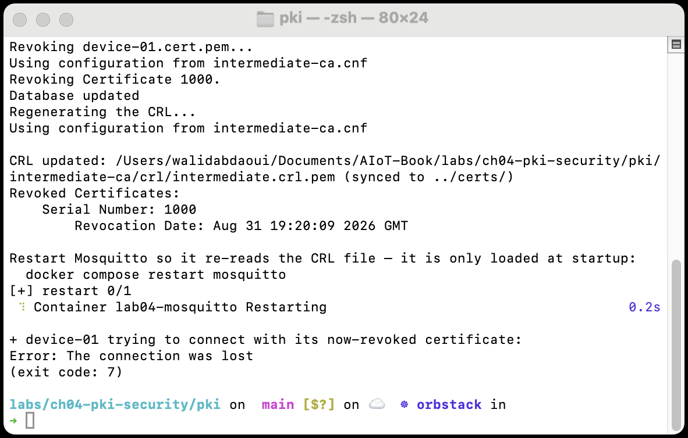

### Part 10: verify device-02 still works

Revocation is per-serial-number, only `device-01`'s was added to the CRL.

```sh
mosquitto_sub -h localhost -p 8883 \
  --cafile pki/root-ca/certs/ca.cert.pem \
  --cert pki/device-02.cert.pem --key pki/device-02.key.pem \
  -t 'devices/device-02/telemetry/#' -C 1 &
sleep 1
mosquitto_pub -h localhost -p 8883 \
  --cafile pki/root-ca/certs/ca.cert.pem \
  --cert pki/device-02.cert.pem --key pki/device-02.key.pem \
  -t 'devices/device-02/telemetry/reading' -m '{"t":21.0}'
wait
```

```
{"t":21.0}
```

Revoking one identity never touches another.

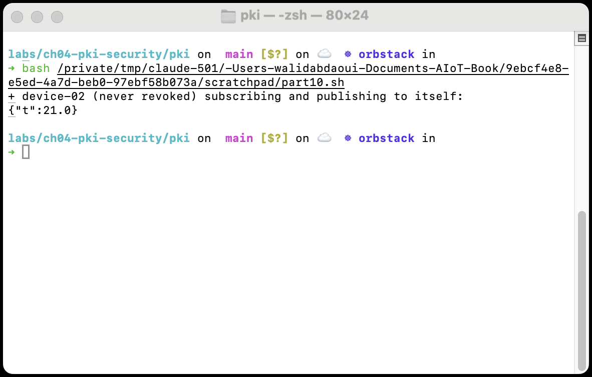

## What was demonstrated

- **Trust establishment.** The Root CA defines the local trust anchor (Part 1).
- **Certificate-path validation.** Leaf certificates must chain to it, a correct name is not enough on its own (Part 6).
- **Proof of possession.** A TLS peer must hold the private key matching its certificate (Part 5).
- **Authorization.** Successful mTLS authentication does not grant unrestricted MQTT access (Part 8).
- **Revocation.** A certificate can be rejected before its expiry date, on a timeline the CA controls (Parts 9-10).
- **Server identity.** A certificate valid for a trusted root must also be valid for the specific endpoint reached (Part 7).

This lab uses private-key files on disk for visibility. In a production device, the private key should live inside a secure element instead.

## Optional Edge AI mini-extension

The same integrity check that protects firmware applies to a model file, it is just a hash over different bytes.

```sh
echo "not a real model, just bytes for the demo" > model.tflite
sha256sum model.tflite
```

```
Original model
SHA-256 = 8f652583f9c2905c232e1e789a237fe75100cb617d5bbba4bb35c37fed0c89c0
```

Now modify it, even by one byte, and hash it again:

```sh
printf '\x01' >> model.tflite
sha256sum model.tflite
```

```
Modified model
SHA-256 = 91c60211fff35fcdd95e4f72a4e8dc82c1c42a8755a988191a4abe419f8aaaf4
```

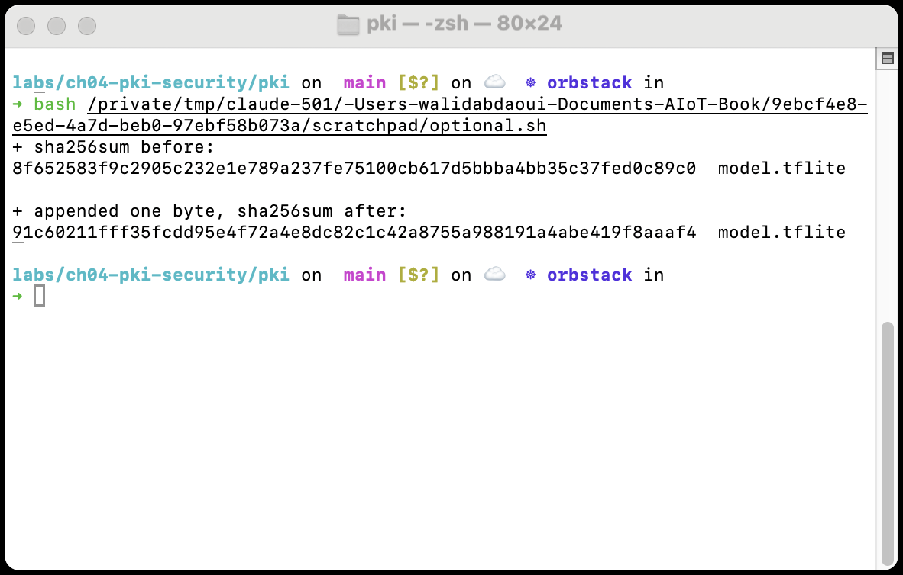

The hash changes completely from a single appended byte. A model is an artifact whose integrity can be verified exactly like firmware, the mechanism does not care whether the bytes it is signing are a bootloader or a `.tflite` file. Chapter 4, section 4.7, covers this in full.

## Production considerations

This lab simplifies several operational aspects. Production systems should additionally consider:

- Secure device enrollment, a signed CSR alone is never sufficient to obtain a certificate.
- Hardware protection of private keys.
- Certificate rotation ahead of expiry, and CA key protection, typically offline or hardware-backed for a Root CA.
- A defined revocation distribution and refresh strategy, not a manual restart.
- Least-privilege authorization, narrower than this lab's `readwrite` ACL.
- Monitoring of certificate failures and abnormal authentication attempts.

## Cleanup

```sh
cd ch04-pki-security
docker compose down -v
```

To also remove the generated PKI material (gitignored, nothing here is tracked):

```sh
rm -rf pki/root-ca pki/intermediate-ca pki/rogue pki/*.key.pem pki/*.cert.pem certs/*.pem
```

## Test

```sh
FULL=1 ./tests/smoke.sh
```

Generates the full PKI, brings up the broker, and checks every part above by script: valid connect, missing certificate, untrusted CA, correct and wrong hostname, own-topic versus cross-device authorization, revocation, and that revoking one device never touches another.

## Troubleshooting

| Symptom | Cause | Fix |
| :---- | :---- | :---- |
| `pki/*.sh: Permission denied` | Scripts not executable | `chmod +x pki/*.sh` |
| `docker compose up` fails: Mosquitto can't find a cert file | `06-sync-broker-certs.sh` wasn't run, or ran before certs were issued | Run the scripts in order: init root, init intermediate, issue certs, sync broker certs, `docker compose up` |
| A trusted device is rejected | Broker certs are stale relative to the CA, or Mosquitto needs a restart | Re-run `06-sync-broker-certs.sh`, then `docker compose restart` |
| Part 8's subscriber never gets the message, even on its own topic | Publisher and subscriber CN don't match the topic's `<id>` segment | Topics must be `devices/<CN-of-the-cert-used>/telemetry/...` |
| `mosquitto_pub`/`mosquitto_sub`: command not found | `mosquitto-clients` not installed | `brew install mosquitto` (macOS) or `apt install mosquitto-clients` (Debian/Ubuntu) |
| Revoking `device-01` doesn't reject it | Mosquitto hasn't reloaded the CRL | `docker compose restart mosquitto` after `04-revoke-cert.sh` |
| Part 7's correct-hostname test also fails | `-CAfile` points at the chain bundle instead of the root, or the broker cert's SAN didn't include `localhost` | Re-check the exact path, re-issue the broker cert with the SAN string from Part 3 |
| Port `8883` already in use | Another lab's broker, or a leftover container | `docker compose down -v` here first, or `lsof -i :8883` |
| `openssl` errors about an existing serial/index file | Re-running init scripts against a PKI that already exists | Remove the generated PKI (see Cleanup), redo the procedure in order |

## Going further

- Add a second intermediate CA for operator or maintenance certificates, separate from device certificates.
- Rotate the broker certificate and confirm existing device certificates still validate through the unchanged intermediate.
- Apply the least-privilege ACL pattern commented in `mosquitto/config/acl.conf`, confirm `device-01` can no longer subscribe to its own `commands` topic, only receive it.
- Shorten the CRL's `default_crl_days` in `pki/intermediate-ca.cnf`, observe what happens to a client's `crl_check` once the CRL expires.
- Extend `acl.conf` with a separate operator identity allowed to publish on `devices/+/commands/#`, confirm no device certificate can do the same.
