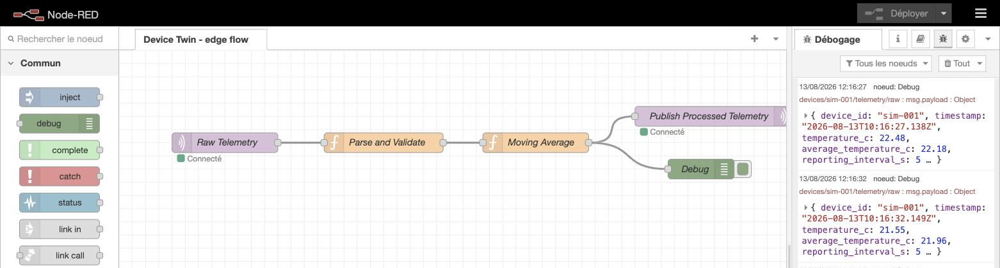
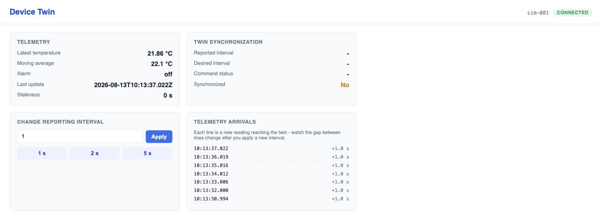
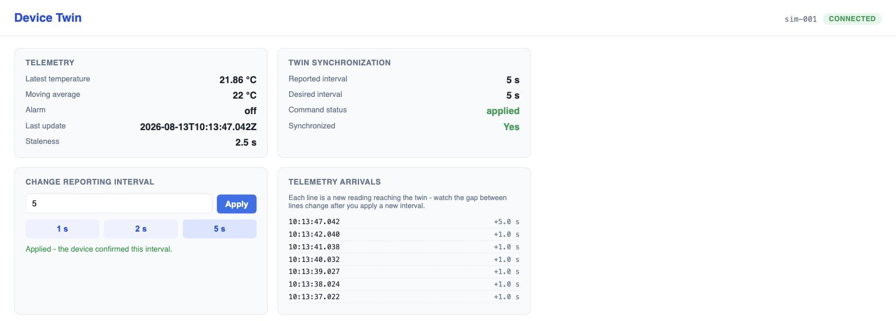
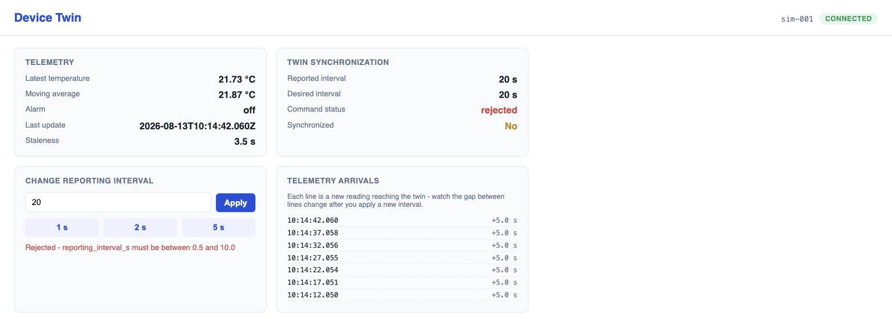

# Lab 5: Device Twin, Close the Loop Between Platform and Device

**Mission.** Change a simulated device's telemetry reporting frequency through a Device Twin, and watch the command travel from requested to confirmed, never assuming the two are the same thing. Software only, Docker is the only requirement, no physical hardware. About 20 to 30 minutes.

## What you will learn

- The difference between a device's desired state (what the platform is asking for) and its reported state (what the device confirms it did).
- How to trace one command end to end: UI, twin API, MQTT, device, acknowledgement, API, UI.
- Why "published" or "pending" does not mean "applied."
- How to read a `synchronized` flag as two independent states agreeing, not a single source of truth.
- Why a local edge gateway (Node-RED) keeps processing telemetry with no dependency on the twin being reachable.

## Architecture


| Service | Role |
| :---- | :---- |
| `mosquitto` | MQTT broker, the only channel the device and platform share |
| `device-simulator` | Stands in for the physical device, publishes telemetry, applies or rejects desired-state commands |
| `node-red` | Edge gateway, validates raw telemetry, keeps a 5-sample moving average, republishes it |
| `twin-api` | FastAPI service, stores desired and reported state in Redis, bridges HTTP and MQTT |
| `redis` | Latest state only, no history |

MQTT topics:

```
devices/sim-001/telemetry/raw
devices/sim-001/telemetry/processed
devices/sim-001/twin/desired
devices/sim-001/twin/reported
```

A Device Twin holds two independent facts for the same device. Nothing forces them to match at any moment, that gap is the whole reason a twin is useful. Neither side calls the other directly, both only publish to or subscribe from Mosquitto, and the device's confirmation arrives on its own schedule, not as a synchronous reply, which is why `command_status` is a real state machine (`pending`, then `applied` or `rejected`) rather than a single yes-or-no return. Node-RED processes telemetry independently of whether `twin-api` is reachable, the same decoupling principle as Lab 1's Redis layer.

## What you need

Docker with Compose v2. Nothing else. [Tutorial T1: Docker startup](../tutorials/docker-startup.md) if this is your first time.

## URLs

| What | URL |
| :---- | :---- |
| Device Twin UI | <http://localhost:8000/> |
| Device Twin API docs | <http://localhost:8000/docs> |
| Node-RED editor | <http://localhost:1880/> |
| Mosquitto | `localhost:1883` |

## Procedure

Every command and screenshot below was run and verified on a real machine.

### Part 1: start the stack

```sh
cd ch05-edge-device-twin
docker compose up --build
```

Wait for all five containers to report healthy, `docker compose ps` or watch the startup log. `twin-api` and `node-red` both wait on Mosquitto's healthcheck first.

### Part 2: open the UI and Node-RED

Open <http://localhost:8000/> for the twin dashboard, and <http://localhost:1880/> to see the edge flow (Raw Telemetry, Parse and Validate, Moving Average, Publish Processed Telemetry) actually running. Click Debug in the sidebar to watch processed messages arrive.



### Part 3: observe telemetry at the initial interval

Telemetry arrives about once a second, the simulator's default, but Reported interval reads a dash, the device has been publishing all along but has never been asked to confirm a configuration. Desired interval is also empty, and Synchronized reads No, nothing has been requested yet.



### Part 4: apply a valid interval

Enter `5` and click Apply, or use the quick 5 s button. The badge shows Pending immediately, then within about a second flips to Applied, `synchronized` reads Yes, and the arrivals list's gaps stretch from `+1.0 s` to `+5.0 s`.



### Part 5: request an invalid interval

Try `20`, outside the device's accepted range of 0.5 to 10. The badge shows Rejected with the device's own reason string, and the reporting interval does not change.



## Expected observations

- Telemetry updates roughly once per `reported_interval` seconds, watch that rate change after Part 4.
- `command_status` is always one of `pending`, `applied`, or `rejected`, copied from what the device actually said, never invented.
- `synchronized` is `Yes` only when desired and reported version and interval both match and the device's status was `applied`. A rejected command never reports synchronized.
- The device validates the requested interval, not the platform, the API accepts any positive number and forwards it.
- The Node-RED Debug sidebar keeps printing processed telemetry even if you stop `twin-api`.
- `average_temperature_c` moves more slowly than `temperature_c`, a 5-sample trailing average.
- This lab changes telemetry frequency, not sampling frequency, the sensor still samples the same, it just decides how often to report what it already knows.

## Cleanup

```sh
docker compose down -v
```

## What this proves

The platform never sets the reporting interval, it only asks. The device is the only party that can confirm what happened, and until it does, the honest answer to "did the change take effect" is "not yet." Part 5 makes the same point from the other direction, a request the platform is free to make is not automatically one the device will honor, and the twin records that disagreement instead of hiding it.

## Test

```sh
./tests/smoke.sh              # fast structural check
FULL=1 ./tests/smoke.sh       # brings the stack up, applies a valid and an invalid interval, confirms both
```

## Troubleshooting

| Symptom | Cause | Fix |
| :---- | :---- | :---- |
| UI shows "unreachable" | `twin-api` container not yet healthy, or not running | `docker compose ps`. `docker compose logs twin-api`. |
| Telemetry never appears in the UI | Node-RED flow not connected to Mosquitto | Open the Node-RED editor, the `mqtt in`/`mqtt out` nodes show a green connected dot when wired correctly |
| `desired` stays empty after clicking Apply | Browser could not reach the API | Check the browser console, confirm `http://localhost:8000/api/health` returns `{"status":"ok"}` |
| Command stuck on "Pending" | The simulator container is not running, or lost its MQTT connection | `docker compose ps device-simulator`. It reconnects automatically after a drop. |
| `docker compose up` fails immediately on `node-red` or `twin-api` | Mosquitto not healthy yet | Both wait on `condition: service_healthy`, give it a few seconds |
| Port already in use (`8000`, `1880`, or `1883`) | Another lab's stack is still up | `docker compose down` in the other lab first |

## Going further

- Add a second simulated device (`sim-002`), confirm the topics, Redis keys, and UI all stay per-device.
- Make the simulator drop desired-state messages for 15 seconds after startup, confirm `command_status` correctly stays `pending` the whole time.
- Raise the simulator's base temperature and confirm the Node-RED flow's `alarm` field flips to `true`, reflected in the UI.
- Redis here only holds the latest state, a hash per device. What would you add to answer "what was the reported interval an hour ago"? A Redis Stream per device is one minimal answer worth prototyping.
