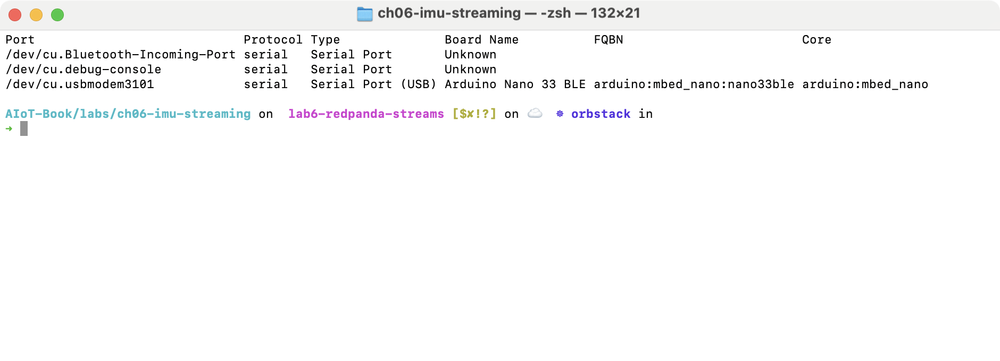
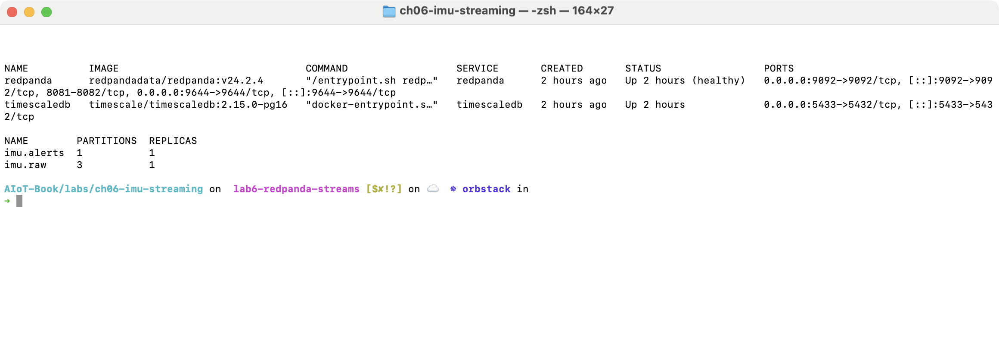
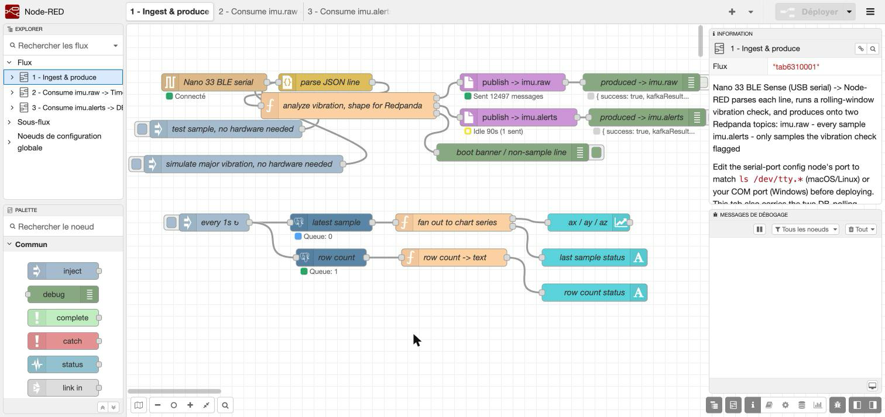
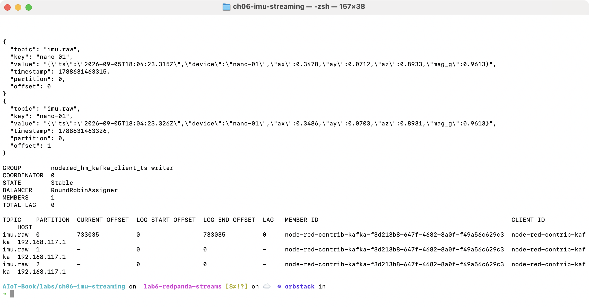
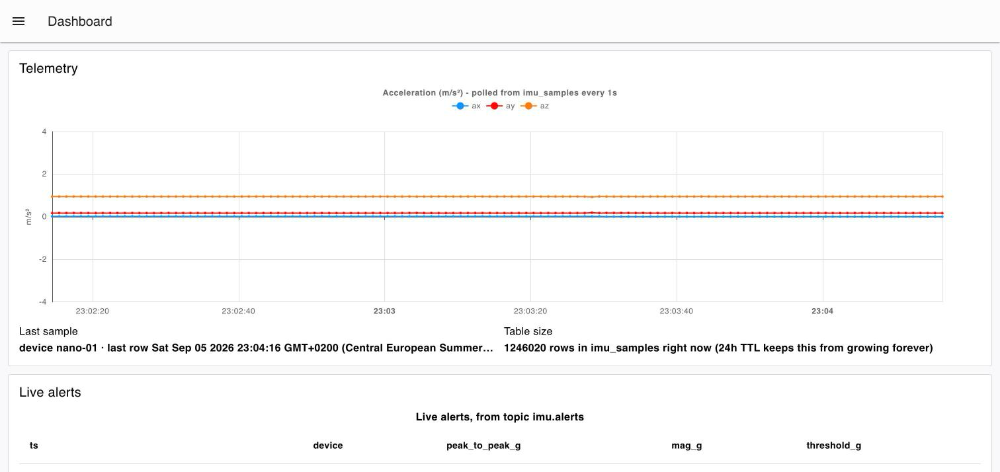
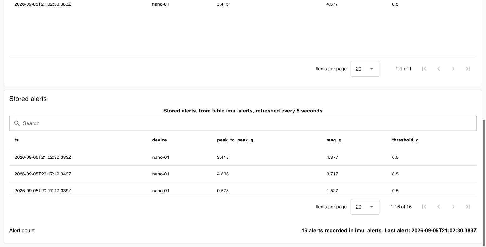
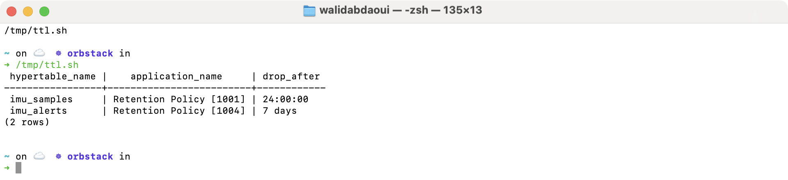

# Lab 6: Sensor Data Streaming

**Mission.** Stream accelerometer measurements from an Arduino Nano 33 BLE Sense through Node-RED and Redpanda. Measurements and vibration alerts are stored in TimescaleDB and displayed on a dashboard. The experiments examine consumer progress, data retention and recovery after interruptions.

## Architecture

![Arduino Nano 33 BLE Sense streams USB serial JSON lines into Node-RED, which decodes and analyzes vibration, then splits the stream into a Redpanda imu.raw topic on every valid measurement and a Redpanda imu.alerts topic when the threshold is crossed. A measurement consumer inserts imu.raw into TimescaleDB's imu_samples table, read periodically by the Telemetry dashboard. An alert consumer inserts imu.alerts into TimescaleDB's imu_alerts table, read periodically by the Stored alerts dashboard, while the alert consumer also feeds the Live alerts dashboard directly](../figures/ch06-lab-architecture.png)

Node-RED runs the vibration analysis before a message reaches Redpanda, so the two topics carry different data: `imu.raw` holds every measurement, `imu.alerts` holds only the ones that crossed the threshold. See [Lab 6: Streaming Technologies](../tutorials/lab06-streaming-technologies.md) for what each technology does and why this lab uses it.

## Requirements

| Item        | Requirement                                                                                                                                 |
|:----------- |:------------------------------------------------------------------------------------------------------------------------------------------- |
| Board       | Arduino Nano 33 BLE Sense, original revision (LSM9DS1 IMU). The Rev2 board uses a different IMU chip and is not supported by this firmware. |
| Cable       | USB data cable, not a charge-only cable                                                                                                     |
| Host OS     | Windows (WSL2), macOS, or Linux                                                                                                             |
| Docker      | Docker Engine with Compose v2                                                                                                               |
| Node.js     | 22.9 or later, required by Node-RED 5                                                                                                       |
| Arduino CLI | Any recent version, or Arduino IDE 2                                                                                                        |

Estimated time: about 55 minutes.

## Procedure

### 1. Flash the board

Run these commands from `ch06-imu-streaming`.

```sh
arduino-cli board list
arduino-cli core install arduino:mbed_nano
arduino-cli lib install "Arduino_LSM9DS1"
arduino-cli compile --fqbn arduino:mbed_nano:nano33ble nano33-firmware
arduino-cli upload -p /dev/cu.usbmodemXXXX --fqbn arduino:mbed_nano:nano33ble nano33-firmware
```

`arduino-cli board list` shows the board's port. Use that port in the upload command. If upload reports `No device found`, double-tap the board's RESET button and try again.



Example output. The board name, port, and FQBN will match what `arduino-cli board list` reports on your machine.

Close any serial monitor connected to the board (Arduino IDE's monitor, `arduino-cli monitor`, or a terminal program). Node-RED needs exclusive access to the port in step 4, and most serial drivers reject a second connection.

### 2. Start Redpanda and TimescaleDB

Run these commands from `ch06-imu-streaming`.

```sh
docker compose up -d
docker compose ps
```

TimescaleDB runs `timescaledb/init.sql` only the first time its data volume is created. A later restart of the containers reuses the existing data and does not run this script again.

Create the two Redpanda topics. `rpk` runs inside the `redpanda` container, so every `rpk` command is prefixed with `docker compose exec redpanda`.

```sh
docker compose exec redpanda rpk topic create imu.raw --partitions 3 --replicas 1
docker compose exec redpanda rpk topic create imu.alerts --partitions 1 --replicas 1
docker compose exec redpanda rpk topic list
```



Example output. Confirm that both services report a running state and that both topics are listed with the partition counts requested above.

### 3. Start Node-RED

Run these commands from `ch06-imu-streaming/nodered`.

```sh
npm install
export PGUSER=aiot
export PGPASSWORD=aiot-imu-dev
./node_modules/.bin/node-red -s ./settings.js
```

Node-RED runs in the foreground in this terminal. Open a second terminal for the remaining steps, since this one stays occupied by the Node-RED process.

### 4. Configure the serial input

Open `http://localhost:1880` in a browser. The editor shows three flow tabs.

1. Open the first tab. Double-click the `serial-port` config node.
2. Set the port to the value found in step 1.
3. Click **Done**, then click **Deploy**.

The `Nano 33 BLE serial` node shows a green `Connected` status once the port opens.



No board available? Click the `test sample, no hardware needed` inject node. It sends one example measurement through the same decode and analysis path a real serial line uses.

### 5. Inspect the measurement stream

Run these commands from `ch06-imu-streaming`, in the second terminal.

```sh
docker compose exec redpanda rpk topic consume imu.raw --num 2
docker compose exec redpanda rpk group describe nodered_hm_kafka_client_ts-writer
docker compose exec timescaledb psql -U aiot -d aiot -c "SELECT count(*) FROM imu_samples;"
```



Example output, with values that vary between runs. `rpk topic consume` prints JSON messages read from `imu.raw`, each keyed by device. `rpk group describe` reports the consumer group's state and its lag, the number of messages produced but not yet read.

Every message is keyed by device. Kafka routes all messages that share a key to the same partition, so with one device every message lands on a single partition. This does not necessarily mean partition 0, and a second device's key is not guaranteed to land on a different partition.

Run the row count query twice, a few seconds apart. The count increases each time, which shows the consumer is inserting rows. The exact increase depends on timing and is not, on its own, a measurement of the sensor's output rate or a check for missing rows.

### 6. Trigger a vibration alert

With the board connected and streaming, move it briefly, without striking it against anything. A short, deliberate motion is enough to cross the threshold.

No board available? Click `test sample, no hardware needed` two or three times first, to give the sliding window some measurements to compare against. Then click `simulate major vibration, no hardware needed`, which sends one measurement far outside the normal range.

```sh
docker compose exec timescaledb psql -U aiot -d aiot -c \
  "SELECT ts, device, peak_to_peak_g, mag_g FROM imu_alerts ORDER BY ts DESC LIMIT 1;"
```

Example output, with values that depend on the motion applied. A new row appears in `imu_alerts`. In the editor, flow tab 3 shows the alert consumer's queue move and the insert result in its debug output.

### 7. Compare live and stored alerts

Open `http://localhost:1880/dashboard/lab6`.

The **Telemetry** group shows the acceleration chart, read from `imu_samples` on a one-second poll. The **Live alerts** group shows a table fed directly from the alert consumer, as each alert arrives. The **Stored alerts** group shows a table read from `imu_alerts` on a five-second poll.

Trigger another alert (step 6) and watch it appear in Live alerts first, then in Stored alerts on its next poll.

The Live alerts table keeps its rows in Node-RED's own memory. Reloading the dashboard page does not clear it, because Node-RED resends the stored rows to the browser. Restarting Node-RED does clear it, because that memory resets with the process. The Stored alerts table always reflects the database, independent of Node-RED's own state.





### 8. Check data retention

```sh
docker compose exec timescaledb psql -U aiot -d aiot -c \
  "SELECT hypertable_name, application_name, config->>'drop_after' AS drop_after
   FROM timescaledb_information.jobs
   WHERE application_name ILIKE '%Retention%' AND hypertable_name IN ('imu_samples','imu_alerts');"
```



Example output. Two rows are expected: `imu_samples` with a `drop_after` of 24 hours, `imu_alerts` with 7 days.

This query confirms the policy is scheduled. It does not show a chunk being dropped. TimescaleDB removes whole chunks once every row in a chunk is older than `drop_after`, on the job's own schedule. Observing a drop takes at least as long as the configured window, which does not fit inside this lab's session.

A topic's own retention, configured on Redpanda, is separate from a table's retention policy in TimescaleDB. This lab does not set a specific retention on either topic, so both keep Redpanda's default.

### 9. Test interruptions and recovery

Each case below starts from the pipeline running normally. Do them one at a time, and let the pipeline recover before starting the next.

**Stop the measurement consumer.** In the editor, right-click flow tab 2 and select **Disable Flow**, then click **Deploy**. Node-RED offers a partial deploy for a single tab: use it, since a full deploy would restart every other tab and interrupt this comparison.

Check `docker compose exec redpanda rpk topic describe imu.raw -p` again. The topic's log continues to grow, since the producer is on a different tab. Check `imu_samples`'s row count: it stops increasing, since its consumer is disabled. Check `imu.alerts` and `imu_alerts`: unaffected, since the alert consumer runs independently.

Re-enable flow tab 2 and deploy again. The consumer resumes from its last committed offset, without a gap and without restarting anything else.

A committed offset confirms that the consumer group has moved past a message. It does not, by itself, confirm that the message's insert into TimescaleDB succeeded, since the two steps are not part of one transaction. The unique index and `ON CONFLICT DO NOTHING` clause on both tables protect against a duplicate row if a message is redelivered. They do not protect against a row that was never inserted.

**Stop Redpanda.**

```sh
docker compose stop redpanda
```

Both producer nodes in the editor report a connection error. Both consumers stop receiving messages. A measurement produced while Redpanda is stopped is not queued or retried by this producer node: it is discarded, and the log line says so.

```sh
docker compose start redpanda
```

The producers and consumers reconnect on their own, without restarting Node-RED. This shows that the pipeline recovers once Redpanda is back. It does not, by itself, show that no message was lost during the interruption.

The flows share one Node-RED process, one broker, and one database. Disabling a single flow tab shows that its own committed offset and its own database writes stop independently of the rest. It does not test what happens if the shared process, the broker, or the database itself fails, since none of those failed in this test.

**Send an invalid measurement.** Edit the `test sample, no hardware needed` inject node's payload to a broken JSON string, then click it. Node-RED logs one parse error for that message and continues processing the next line.

## Stop the lab

```sh
docker compose stop
```

This stops the containers and keeps their data. Press Ctrl+C in the Node-RED terminal to stop Node-RED.

To remove all stored data and start from a clean state:

```sh
docker compose down -v
```

This deletes the Docker volumes, including every row in `imu_samples` and `imu_alerts`. `timescaledb/init.sql` runs again the next time the containers start.

## Troubleshooting

| Symptom                                | Check                                                                                  | Action                                                                                 |
|:-------------------------------------- |:-------------------------------------------------------------------------------------- |:-------------------------------------------------------------------------------------- |
| Serial node stays disconnected         | Port path in the `serial-port` config node, and whether another program holds the port | Close any serial monitor, correct the port, redeploy                                   |
| `rpk: command not found`               | Whether the command was run on the host instead of inside the container                | Prefix the command with `docker compose exec redpanda`                                 |
| No messages in `imu.raw`               | Producer node status in flow tab 1                                                     | Confirm the board is connected and streaming, and that `redpanda` is running           |
| `imu_samples` row count not increasing | Consumer group state, `rpk group describe nodered_hm_kafka_client_ts-writer`           | Confirm flow tab 2 is deployed and enabled                                             |
| No alert appears                       | Number of measurements received before the trigger                                     | Send a few `test sample` injects first, to fill the sliding window                     |
| Port 9092 or 5433 already in use       | Other processes bound to that port                                                     | Change the port in `docker-compose.yml` and the matching Node-RED config node together |

## Going further

**Replay from another consumer group.** Read `imu.raw` from the beginning, without moving the live consumer's offset.

```sh
docker compose exec redpanda rpk topic consume imu.raw --group replay-demo --offset start --num 1000
```

Check `rpk group describe nodered_hm_kafka_client_ts-writer` again. Its lag is unaffected, since it is a separate consumer group with its own committed offset.

**Adjust the alert threshold.** In flow tab 1, open the `analyze vibration, shape for Redpanda` function node. It holds a window size, a peak-to-peak threshold in g, and a cooldown between alerts for the same device. Change the threshold, redeploy, and repeat step 6 to see the effect.

# 
