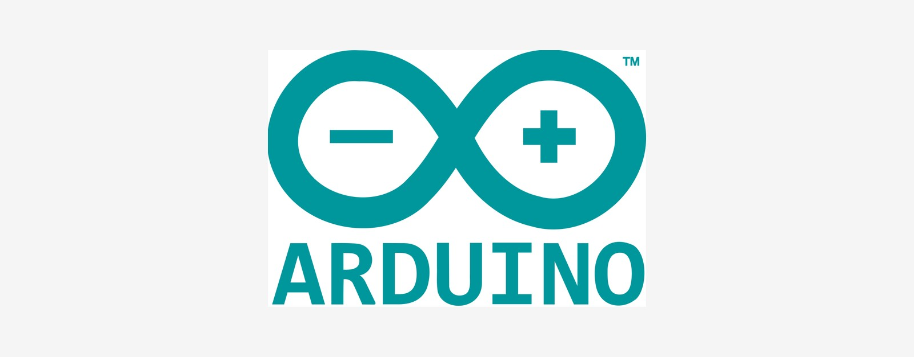

# Tutorial T5: Arduino Nano 33 BLE Sense startup (Windows, macOS, Linux)

Gets an Arduino Nano 33 BLE Sense from "in the box" to a first sketch uploaded and its onboard IMU verified. This is the board Labs 2, 6, 7, 8, 9, 11, 12, 13, 14, and 15 build on. None of Labs 1 to 5's required path needs this board (Lab 2 targets the ESP32-S3), but it is this book's other workhorse, so set it up here if you are equipping the bench for what is ahead.

**Time:** 15 to 20 minutes. **You need:** an Arduino Nano 33 BLE Sense, the Sense variant, not the plain Nano 33 BLE. It adds the LSM9DS1 IMU, the HTS221 humidity and temperature sensor, the LPS22HB pressure sensor, the APDS9960 gesture and light sensor, and the MP34DT05 microphone that later labs read from. See the book's Lab BOM master for sourcing, and a USB cable.

## 1. Install the Arduino IDE

Download Arduino IDE 2.x from [arduino.cc/en/software](https://www.arduino.cc/en/software). The same download page works the same way on all three platforms. Grab the one matching your OS.

- **Windows:** run the `.exe` installer and accept the driver-install prompts during setup.
- **macOS:** open the `.dmg` and drag Arduino IDE into Applications.
- **Linux:** download the `.AppImage`, mark it executable, and run it directly, or use your distro's package if it ships a recent-enough version (`snap install arduino`, or check your distro's repo).

```sh
chmod +x arduino-ide_*.AppImage
./arduino-ide_*.AppImage
```

[FIGURE T5-01: Arduino IDE 2.x first launch]
Type: screenshot
Source: TODO, capture during setup

## 2. Install the board package

The Nano 33 BLE runs on a different core than classic Arduino boards, an nRF52840 through Arm Mbed OS, so its support package is separate from the default Arduino AVR boards.

1. Open Tools, then Board, then Boards Manager (or use the boards icon in the left sidebar).
2. Search for "Nano 33 BLE."
3. Install "Arduino Mbed OS Nano Boards" by Arduino.

   [FIGURE T5-02: Boards Manager, "Arduino Mbed OS Nano Boards" package found and Install button visible]
   Type: screenshot
   Source: TODO, capture during setup

This is a sizeable download, since it includes the compiler toolchain, a few minutes depending on your connection.

## 3. Connect the board and select it

Plug the Nano 33 BLE Sense in over USB. It uses native USB. No driver install is needed on macOS or Linux, and modern Windows (10 or 11) recognizes it automatically too.

1. Tools, then Board, then Arduino Mbed OS Nano Boards, then Arduino Nano 33 BLE.
2. Tools, then Port, then select the port that appeared when you plugged the board in.
   - Windows: `COMx`
   - macOS: `/dev/cu.usbmodemXXXX`
   - Linux: `/dev/ttyACM0`, or similar

   [FIGURE T5-03: Arduino IDE Tools menu, Board and Port both set correctly for the Nano 33 BLE]
   Type: screenshot
   Source: TODO, capture during setup

### Linux: serial port permissions

Same `dialout` group requirement as any USB-serial device on Linux.

```sh
sudo usermod -aG dialout $USER
# log out and back in for the group change to take effect
```

If the port does not appear at all, on any OS, try a different USB cable. Many are charge-only and carry no data lines.

## 4. Upload a first sketch: Blink

Confirm the whole toolchain (IDE, board package, driver, upload) works before touching any lab code.

1. File, then Examples, then 01.Basics, then Blink.
2. Click Upload, the right-arrow icon.

The IDE compiles, then uploads. Watch for the tiny amber LED near the USB connector to double-flash briefly. That is the bootloader engaging during upload. Once done, the onboard LED should blink once per second.

[FIGURE T5-04: Blink sketch uploaded successfully, IDE showing "Done uploading"]
Type: screenshot
Source: TODO, capture during setup

If upload fails with a timeout, double-tap the board's RESET button right before clicking Upload. This manually drops it into bootloader mode, a trick classic Arduino boards do not need but this Mbed-based one occasionally does over some USB hubs.

## 5. Install the sensor libraries

Later labs read the Sense variant's onboard sensors and talk over Wi-Fi or BLE. Install what you will need through Tools, then Manage Libraries (or Sketch, then Include Library, then Manage Libraries).

| Library | Sensor or purpose | Used by |
| :---- | :---- | :---- |
| **Arduino_LSM9DS1** | 9-axis IMU, accelerometer, gyro, magnetometer | Labs 2, 6, 7, 8, 9, 11, 12, 13 |
| **Arduino_HTS221** | Humidity and temperature | Lab 8 |
| **Arduino_LPS22HB** | Barometric pressure | Lab 8 |
| **Arduino_APDS9960** | Gesture, proximity, light, colour | Lab 9 (optional extensions) |
| **PDM** (bundled with the board package) | Onboard MP34DT05 microphone | Lab 15 |
| **ArduinoBLE** | Bluetooth Low Energy | Labs 9, 11 (BLE result publishing) |
| **WiFiNINA** | Wi-Fi, the Sense's onboard module | Lab 6 |
| **ArduinoMqttClient** | MQTT over the Wi-Fi or BLE connection above | Lab 6 |

[FIGURE T5-05: Library Manager with Arduino_LSM9DS1 installed]
Type: screenshot
Source: TODO, capture during setup

## 6. Verify the IMU

File, then Examples, then Arduino_LSM9DS1, then SimpleAccelerometer. Upload it, then open Tools, then Serial Monitor, and set the baud rate shown at the top of the sketch, typically 9600. Tilt the board. The X, Y, Z accelerometer values printed should change in response.

[FIGURE T5-06: Serial Monitor showing live accelerometer X/Y/Z values changing as the board is tilted]
Type: screenshot
Source: TODO, capture during setup

This confirms the sensor, not just the upload path, works. It is exactly what Lab 6's `nano33-publisher/sketch.ino` and every later IMU-driven lab build on.

## Troubleshooting

| Symptom | Cause | Fix |
| :---- | :---- | :---- |
| Board does not show under Tools, then Port | Charge-only USB cable, or the board package is not installed yet | Swap the cable. Confirm "Arduino Mbed OS Nano Boards" is installed under Boards Manager. |
| Upload times out or fails | Board did not enter bootloader in time | Double-tap RESET right before clicking Upload |
| `Permission denied` opening the port (Linux) | Not in `dialout` | Run `sudo usermod -aG dialout $USER`, then log out and back in |
| Compile error: `Arduino_LSM9DS1.h: No such file or directory` | Library not installed | Tools, then Manage Libraries, then search and install `Arduino_LSM9DS1` |
| IMU values all read `0` or do not change | `IMU.begin()` never succeeded, or the sketch reads before it returns true | Confirm the sketch checks `while (!IMU.begin())` before entering the read loop, see `nano33-publisher/sketch.ino` for the pattern this book uses |
| Two boards plugged in and the wrong one is selected | Multiple Arduino or serial devices connected | Check Tools, then Port carefully, or unplug the other device while flashing |
| WiFiNINA or MQTT sketches (Lab 6) cannot connect | Wrong SSID or PSK hardcoded, or the Pi's or laptop's broker LAN IP changed | Re-check `WIFI_SSID`, `WIFI_PSK`, and `MQTT_HOST` at the top of the sketch match your current network |

## Next

Your Nano 33 BLE Sense is uploading sketches and its IMU is confirmed working. Labs 1 to 5 do not need this board, head to the [labs README](../README.md) for those, but it is the board [Lab 6](../ch06-imu-streaming/README.md) picks up from here.
