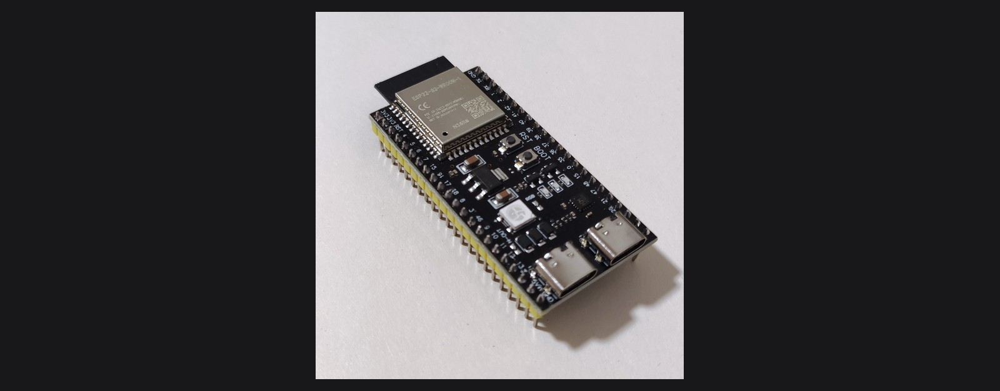

*Photo: [VectorVoyager](https://commons.wikimedia.org/wiki/File:ESP32-S3_on_paper.jpg), CC BY-SA 4.0, cropped and resized.*

# Tutorial T2: ESP32-S3 startup (Windows, macOS, Linux)

Gets a bare ESP32-S3 board from "in the box" to "the host can talk to it and flash firmware." This is the prerequisite for Lab 2 (RTOS scheduling latency) and every later ESP32-S3 lab (4, 11, 12, 15, 16).

**Time:** 15 to 20 minutes. **You need:** an ESP32-S3 development board. This book's primary board is the Seeed Studio XIAO ESP32-S3, thumbnail-sized, with native USB-Serial/JTAG. An ESP32-S3-DevKitC-1 works identically for everything below. See the book's Lab BOM master for sourcing, and its USB-C cable.

This tutorial sets up PlatformIO, a build, flash, and monitor tool that manages the ESP-IDF toolchain for you, with no manual ESP-IDF install required. If you specifically want raw ESP-IDF, needed for some advanced workflows, see [Tutorial T3: FreeRTOS for ESP32-S3 startup](./freertos-esp32-s3-startup.md) instead. Both toolchains target the same chip and both work for Lab 2.

## 1. Know your USB port

Most ESP32-S3 dev boards have the USB peripheral built into the chip itself, native USB-Serial/JTAG. No CP210x or FTDI driver is needed on Windows 10+, macOS, or Linux. If your board is an older DevKitC variant with a separate USB-to-serial bridge chip, see the Windows driver note below.

Plug the board in over its main USB-C port. On boards with two USB connectors, a UART port and a USB or native port, use the one labelled `USB`, closer to the antenna.

## 2. Install Python 3 and PlatformIO

PlatformIO is a Python package. Any Python 3.9 or newer works.

### Windows

1. Install Python from python.org, and check "Add python.exe to PATH" during setup, or install it from the Microsoft Store.
2. Open PowerShell:
   ```powershell
   pip install platformio
   pio --version
   ```
3. **Driver check.** Open Device Manager with the board plugged in. If it shows up under "Ports (COM & LPT)" as something like `USB Serial Device (COM5)` or `USB JTAG/serial debug unit (COM5)`, you are done, no driver needed. If it shows an unrecognized device instead, install the [CP210x VCP driver](https://www.silabs.com/developers/usb-to-uart-bridge-vcp-drivers). This applies to older DevKitC boards only.

   [FIGURE T2-01: Windows Device Manager showing the ESP32-S3 as a COM port]
   Type: screenshot
   Source: TODO, capture during setup

4. Find the port name, `COM5`, `COM7`, or similar, in Device Manager. You will pass it to PlatformIO as `--upload-port COMx` if auto-detection does not find it.

### macOS

```sh
python3 -m pip install --user platformio
~/Library/Python/3.*/bin/pio --version   # or just `pio --version` if it is already on PATH
```

No driver needed. The native USB-Serial/JTAG interface shows up immediately. Confirm the port:

```sh
ls /dev/cu.usbmodem*
# /dev/cu.usbmodem1101  <- yours will differ
```

### Linux

```sh
python3 -m pip install --user platformio
export PATH="$HOME/.local/bin:$PATH"     # add this line to ~/.bashrc or ~/.zshrc too
pio --version
```

**Serial port permissions.** Your user needs to be in the `dialout` group (Debian/Ubuntu) or `uucp` (Arch) to open `/dev/ttyACM*` without `sudo`.

```sh
sudo usermod -aG dialout $USER
# log out and back in, or reboot, for the group change to take effect
groups | tr ' ' '\n' | grep dialout
```

Confirm the port:

```sh
ls /dev/ttyACM*
# /dev/ttyACM0  <- yours may differ if you have other serial devices plugged in
```

## 3. Verify the board is detected

From any OS, with PlatformIO installed:

```sh
pio device list
```

Your board's port should appear in the list. If you would rather use `esptool` directly, PlatformIO installs its own copy, or run `pip install esptool` for a standalone one:

```sh
esptool.py --port <PORT> --before default_reset --after no_reset chip_id
```

Expected output:

```
Detecting chip type... ESP32-S3
Chip type:          ESP32-S3 (QFN56) (revision v0.2)
Features:           Wi-Fi, BT 5 (LE), Dual Core + LP Core, 240MHz, Embedded PSRAM 8MB
Crystal frequency:  40MHz
USB mode:           USB-Serial/JTAG
MAC:                1c:db:d4:75:87:dc
```

[FIGURE T2-02: `esptool chip_id` output identifying an ESP32-S3]
Type: screenshot
Source: TODO, capture during setup

If you see `Detecting chip type... ESP32-S3` and a MAC address, the board is healthy and the host can talk to it. The hardware side is done.

## 4. First flash: Lab 2

There is no throwaway "Blink" step here. Lab 2's `superloop/` project is the minimal first flash, and it doubles as your toolchain check.

```sh
cd ch02-rtos-latency/superloop
pio run -t upload -t monitor
```

The first `pio run` downloads the ESP-IDF toolchain PlatformIO needs, a few hundred MB, one time, a few minutes. After that, expect output like:

```
REPORT  events=10  worst_latency=20581 us (20.6 ms)  cpu_idle=0.0%
```

If your board does not auto-detect, add the port explicitly: `pio run -t upload -t monitor --upload-port COM5` on Windows, or `--upload-port /dev/ttyACM0` on Linux, or `/dev/cu.usbmodem1101` on macOS.

[FIGURE T2-03: PlatformIO build, upload, and monitor output for Lab 2's superloop firmware]
Type: screenshot
Source: TODO, capture during setup

Press `Ctrl-C` to leave the monitor. That proves the whole toolchain end to end. Your board is ready for the rest of [Lab 2](../ch02-rtos-latency/README.md).

## 5. Bootloader entry, if auto-reset ever fails

The native USB-Serial/JTAG interface normally resets the chip into the bootloader automatically before a flash. If a flash ever times out waiting for the chip, force it manually.

1. Hold the BOOT button, labelled `BOOT` or `IO0`.
2. Tap RESET, or `EN`.
3. Release BOOT.

The board is now waiting for `esptool` or PlatformIO to flash it. Tap RESET again after flashing to boot the new firmware normally.

## Troubleshooting

| Symptom | Cause | Fix |
| :---- | :---- | :---- |
| `pio: command not found` | The pip install location is not on `PATH` | Add `~/.local/bin` (Linux/macOS), or restart the terminal (Windows) after install |
| Board does not appear in `pio device list` or Device Manager | Bad cable (charge-only, no data lines), or the wrong USB port on a two-port board | Swap the cable. Use the port labelled `USB`, not `UART`. |
| `Permission denied: '/dev/ttyACM0'` (Linux) | User not in `dialout` | Run `sudo usermod -aG dialout $USER`, then log out and back in |
| `A serial exception error occurred: could not open port` | Another program, such as Arduino IDE or a stale monitor, holds the port | Close other serial monitors. On Linux, `fuser /dev/ttyACM0` finds the PID. |
| `Detecting chip type... unknown`, or timeout during flash | Bootloader not entered | Use the manual BOOT and RESET sequence in step 5 |
| Garbled serial output | Wrong baud rate | This book's firmware uses 115200 baud. Confirm with `--baud 115200`. |
| `Brownout detector was triggered`, reboot loop | USB cable too long or underpowered, or a bus-powered hub | Try a shorter cable, or plug directly into the host instead of a hub |
| First `pio run` takes several minutes | PlatformIO downloading the toolchain, one time | Normal. Subsequent builds take seconds. |
| `Flash memory size mismatch detected` warning | Board variant reports a different flash size than `sdkconfig.defaults` assumes | Cosmetic on most XIAO ESP32-S3 revisions. Safe to ignore for this book's firmware. |

## Next

Your board is flashing and monitoring correctly. Go run the full [Lab 2: Super-loop vs FreeRTOS Scheduling](../ch02-rtos-latency/README.md), or, if you want to understand the FreeRTOS side of what you just flashed before touching the code, read [Tutorial T3: FreeRTOS for ESP32-S3 startup](./freertos-esp32-s3-startup.md) first.
