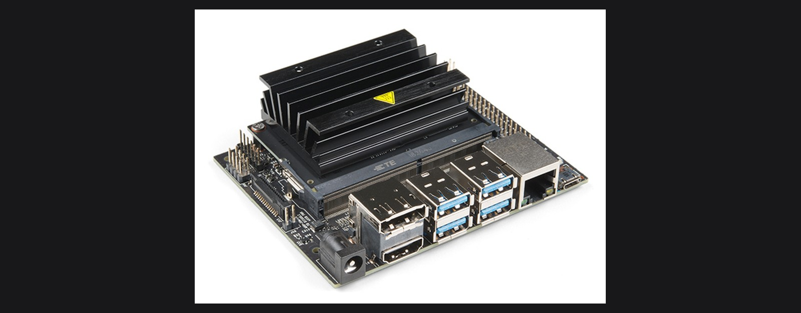

*Photo: [SparkFun Electronics](https://commons.wikimedia.org/wiki/File:NVIDIA_Jetson_Nano_Developer_Kit_(47616885631)_(cropped).jpg), CC BY 2.0, cropped and resized.*

# Tutorial T7: Jetson Nano startup (Windows, macOS, Linux)

Gets an NVIDIA Jetson Nano Developer Kit from a bare board to running Docker and reachable over SSH, with its GPU actually verified working. Chapter 2 introduces the Jetson Nano as one of the book's four core hardware platforms, the one that adds a GPU to the edge tier for heavier embedded vision work. No lab in this book currently requires one, Chapter 14's vision lab targets a Nano 33 BLE Sense and an OV7670 camera instead, so treat this tutorial as equipping the bench for GPU-accelerated vision work you extend yourself, not as a prerequisite for a numbered lab.

**Time:** 30 to 45 minutes, plus unattended flashing time. **You need:** a Jetson Nano Developer Kit (the original, not the newer Orin Nano, which uses a different image and flashing tool), a 5V/4A barrel-jack power supply or a J48 jumper plus a good 5V/2.5A micro-USB supply, a microSD card of 32 GB or more (UHS-1 or better), a card reader, a monitor with HDMI or DisplayPort, a USB keyboard and mouse for first boot only, and a wired Ethernet connection recommended over Wi-Fi for the initial setup.

## 1. Flash the Jetson Nano Developer Kit SD Card Image

The Jetson Nano Developer Kit boots from a microSD card, no separate flashing host or NVIDIA SDK Manager needed for this board (SDK Manager is for the eMMC-based Jetson variants).

1. Download the current SD Card Image for the Jetson Nano Developer Kit from [developer.nvidia.com/embedded/jetpack](https://developer.nvidia.com/embedded/jetpack-archive). The original Jetson Nano's last supported release is the JetPack 4.6.x line, built on Ubuntu 18.04. Newer JetPack 5 and 6 releases target the Orin family, not this board, do not flash them here.
2. Install [balenaEtcher](https://etcher.balena.io/) if you do not already have it, it runs identically on Windows, macOS, and Linux.
3. Insert the microSD card, open Etcher, select the downloaded image, select the card, and flash. Etcher writes and verifies the image, several minutes depending on card speed.

   [FIGURE T7-01: balenaEtcher with the Jetson Nano SD card image selected, ready to flash]
   Type: screenshot
   Source: TODO, capture during setup

Unlike Raspberry Pi Imager, this image has no built-in step for pre-seeding Wi-Fi, a hostname, or SSH before first boot. The initial setup runs interactively on the board itself.

## 2. First boot and initial setup

The Jetson Nano's first boot needs a monitor, keyboard, and mouse connected directly to it, there is no equivalent to Raspberry Pi Imager's headless customization for this image.

1. Insert the microSD card, connect the monitor, keyboard, and mouse, connect Ethernet if available, then apply power.
2. On the first boot, Ubuntu's OEM setup wizard runs: accept the NVIDIA Jetson software EULA, then set your language, keyboard layout, timezone, and a username and password.
3. When asked about APP partition size, accept the default (it uses the full available card space) unless you specifically need to leave room for a dual-boot setup, which is unusual for this board.
4. Let the board finish booting to the desktop.

   [FIGURE T7-02: Jetson Nano OEM setup wizard, username and password screen]
   Type: screenshot
   Source: TODO, capture during setup

## 3. Find its IP address and connect over SSH

The SD card image ships with `openssh-server` already enabled, so once initial setup is complete, everything from here runs headless.

1. On the Jetson's desktop, open a terminal and run `hostname -I`, or check your router's client list for the hostname you set.
2. From your other computer:

   ```sh
   ssh username@<jetson-ip-address>
   ```

   Windows 10 (1809+) and Windows 11 ship an SSH client in PowerShell already. macOS and Linux have one built in. Accept the host key fingerprint prompt on first connection.

Once this works, you can disconnect the monitor, keyboard, and mouse for everything that follows.

[FIGURE T7-03: First SSH login to the Jetson Nano from a laptop]
Type: screenshot
Source: TODO, capture during setup

## 4. Update the system

```sh
sudo apt-get update
sudo apt-get -y dist-upgrade
sudo reboot
```

Wait about 30 seconds and SSH back in. `dist-upgrade` rather than plain `upgrade` here because NVIDIA's L4T (Linux for Tegra) packages occasionally need to change package dependencies, not just versions.

## 5. Verify the GPU with tegrastats or jtop

Jetson Nano is a Tegra SoC with an integrated GPU, not a discrete NVIDIA GPU, so `nvidia-smi` does not exist on this board and will not work. Use the tools built for this platform instead.

The built-in option needs nothing extra:

```sh
tegrastats
```

This prints a live line of CPU, GPU, and memory utilization every second. `GR3D_FREQ` above 0% while running a GPU workload confirms the GPU is active. Press Ctrl-C to stop.

For a friendlier view, install `jetson-stats`:

```sh
sudo pip3 install -U jetson-stats
sudo reboot
```

After reboot, run `jtop` for an interactive dashboard of CPU, GPU, memory, and power draw, along with the exact JetPack, L4T, and CUDA versions installed on this board.

[FIGURE T7-04: jtop running over SSH, GPU utilization panel visible]
Type: screenshot
Source: TODO, capture during setup

## 6. Install Docker

Docker's convenience script installs cleanly on L4T's Ubuntu 18.04 base, the same approach as [Tutorial T4: Raspberry Pi startup](./raspberrypi-startup.md#5-install-docker-on-the-pi):

```sh
curl -fsSL https://get.docker.com -o get-docker.sh
sudo sh get-docker.sh
sudo usermod -aG docker $USER
newgrp docker
```

Verify:

```sh
docker --version
docker compose version
docker run hello-world
```

## 7. GPU access inside containers

A plain `docker run` container cannot see the GPU by default, the same as on any Docker host. NVIDIA's JetPack repositories provide an `nvidia-container-runtime` package that plugs into Docker, this is what lets a container use CUDA and the vision libraries pre-installed on the base OS.

```sh
sudo apt-get install -y nvidia-container-runtime
```

The exact configuration step that wires this runtime into Docker's default runtime has shifted across JetPack releases, follow [NVIDIA's current container documentation](https://docs.nvidia.com/jetson/) for the JetPack version `jtop` reported in step 5, rather than a single fixed recipe here. Once configured, a container started with `--runtime nvidia` (or with the runtime set as Docker's default) can call CUDA the same as a process running directly on the host.

## Troubleshooting

| Symptom | Cause | Fix |
| :---- | :---- | :---- |
| Board powers on (green LED) but nothing appears on the monitor | Wrong display input selected, or a cable that carries no signal | Try a different HDMI cable or port, confirm the monitor input source |
| OEM setup wizard never appears, board boots straight past it | A previously-used SD card with setup already completed | Re-flash the card, first-boot setup only runs once per image |
| `ssh: connect to host <ip> port 22: Connection refused` | SSH not yet started, or wrong IP | Confirm you are through the OEM setup wizard first, re-check the IP with `hostname -I` on the board |
| Board is very slow, or random reboots under load | A micro-USB power supply under 2.5A cannot sustain the board under full CPU+GPU load | Use the 5V/4A barrel-jack supply with the J48 jumper set, especially before running any GPU workload |
| `tegrastats` shows `GR3D_FREQ 0%` during a workload that should use the GPU | The workload is running on CPU only, e.g. a non-GPU-enabled build of a library | Confirm the library in use was built with CUDA/TensorRT support for this platform, check with `jtop` |
| `docker run --runtime nvidia ...` fails with an unknown runtime error | `nvidia-container-runtime` installed but not registered as a Docker runtime | Check `/etc/docker/daemon.json` against NVIDIA's current container documentation for your JetPack version, then `sudo systemctl restart docker` |
| Flashing an image downloaded from JetPack 5 or 6 fails to boot | Those releases target the Orin family, not the original Jetson Nano | Use a JetPack 4.6.x SD card image, the last release built for this board |

## Next

Your Jetson Nano is running Docker over SSH with its GPU verified through `tegrastats` or `jtop`. Back to the [labs README](../README.md) for the full lab list.
