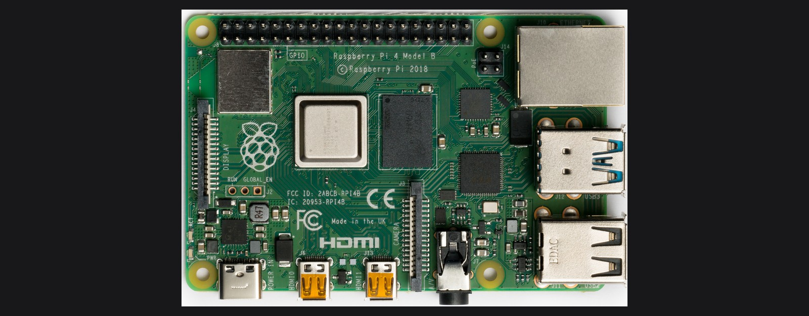

*Photo: [Laserlicht](https://commons.wikimedia.org/wiki/File:Raspberry_Pi_4_Model_B_-_Top.jpg), CC BY-SA 4.0, cropped and resized.*

# Tutorial T4: Raspberry Pi startup (Windows, macOS, Linux)

Gets a Raspberry Pi from a bare board to running Docker and reachable over SSH. It is used as an edge host in Lab 16 (the industrial capstone's PLC-bridged edge tier). None of Labs 1 to 5 need a Pi, they run on your laptop, but if you are equipping the bench for the whole book, do this once.

**Time:** 20 to 30 minutes, mostly unattended (imaging and first boot). **You need:** a Raspberry Pi 4 or 5 with 4 GB or more RAM recommended, see the book's Lab BOM master, a microSD card of 16 GB or more, a card reader, and a second computer (Windows, macOS, or Linux) to prepare the card. A separate monitor and keyboard for the Pi are optional. This tutorial sets up headless, SSH-only access.

## 1. Flash Raspberry Pi OS with Raspberry Pi Imager

Raspberry Pi Imager runs on Windows, macOS, and Linux identically. Download it from [raspberrypi.com/software](https://www.raspberrypi.com/software/), or run `brew install --cask raspberry-pi-imager` on macOS, or use your Linux distro's package manager or a Flatpak.

1. Insert the microSD card into your computer.
2. Open Raspberry Pi Imager and choose:
   - **Device:** your Pi model, 4 or 5.
   - **OS:** "Raspberry Pi OS (64-bit)." The standard, non-Lite version is fine and includes a desktop you likely will not use. Lite works too if you want the smallest image and are comfortable headless from boot.
   - **Storage:** your microSD card. Double-check this. Imager erases whatever is selected.

   [FIGURE T4-01: Raspberry Pi Imager, OS and Storage selection screen]
   Type: screenshot
   Source: TODO, capture during setup

3. Click Next, then Edit Settings when Imager asks whether to apply OS customisation. Say yes. This is what makes the Pi headless-ready on first boot.
   - **General tab:** set a hostname (for example `aiot-pi`), a username and password, and your Wi-Fi SSID and password (skip Wi-Fi if you will use Ethernet).
   - **Services tab:** enable SSH, with "Use password authentication," or paste a public key if you already manage SSH keys.

   [FIGURE T4-02: Raspberry Pi Imager OS Customisation dialog, General tab with hostname, Wi-Fi, and SSH fields filled in]
   Type: screenshot
   Source: TODO, capture during setup

4. Click Save, then Yes to apply, then confirm the erase warning. Imager writes and verifies the image, a few minutes depending on card speed.

## 2. First boot

1. Insert the microSD card into the Pi and power it on. Give it 60 to 90 seconds for the first boot. It resizes the filesystem and applies your customisation on this run only.
2. Find its IP address. The easiest way is checking your router's client list for the hostname you set, or:
   ```sh
   ping aiot-pi.local     # mDNS, works out of the box on macOS/Linux
                           # on Windows, install Bonjour Print Services or
                           # just use the IP from your router instead
   ```

## 3. Connect over SSH

### Windows

Windows 10 (1809 or later) and Windows 11 ship an SSH client in PowerShell already:

```powershell
ssh username@aiot-pi.local
# or: ssh username@<ip-address>
```

If that command is not found, install the optional "OpenSSH Client" Windows feature (Settings, then Apps, then Optional Features, then Add a feature), or use [PuTTY](https://www.putty.org/) as a GUI alternative.

### macOS / Linux

```sh
ssh username@aiot-pi.local
# or: ssh username@<ip-address>
```

Accept the host key fingerprint prompt on first connection.

[FIGURE T4-03: First SSH login to the Pi, showing the Raspberry Pi OS welcome banner]
Type: screenshot
Source: TODO, capture during setup

## 4. Update the system

Once logged in, this part is identical regardless of which OS you SSH'd from, since you are now inside Raspberry Pi OS, a Debian derivative:

```sh
sudo apt-get update
sudo apt-get -y full-upgrade
sudo reboot
```

Wait about 30 seconds and SSH back in.

## 5. Install Docker on the Pi

Raspberry Pi OS is Debian-based, so this follows the same Linux path as [Tutorial T1: Docker startup](./docker-startup.md#linux-ubuntudebian-shown-notes-for-fedoraarch-below), run on the Pi itself over SSH, not on your laptop.

```sh
curl -fsSL https://get.docker.com -o get-docker.sh
sudo sh get-docker.sh
sudo usermod -aG docker $USER
newgrp docker
```

Docker's convenience script is the fastest reliable path on Raspberry Pi OS's ARM architecture. It detects the platform and installs the matching packages automatically. Compose v2 ships as part of that install. Verify:

```sh
docker --version
docker compose version
docker run hello-world
```

[FIGURE T4-04: `docker run hello-world` succeeding over SSH on the Pi]
Type: screenshot
Source: TODO, capture during setup

## 6. Optional: run a local LLM with Ollama

No lab currently requires this on the Pi specifically, Lab 15's local-LLM lab runs Ollama on a laptop instead, but the same install works here if you would rather host it on the Pi:

```sh
curl -fsSL https://ollama.com/install.sh | sh
ollama pull qwen2.5:0.5b
ollama list
```

Start with the 0.5B model on a Pi 4. Only try a larger one after the small model works end to end.

## Troubleshooting

| Symptom | Cause | Fix |
| :---- | :---- | :---- |
| Imager's erase warning shows the wrong device | Multiple removable drives connected | Unplug other USB drives or cards before selecting Storage, and re-check the size shown matches your microSD card |
| Pi never appears on the network after first boot | Wi-Fi credentials wrong in OS Customisation, or the Pi needs more than 90 seconds on a slow card | Re-run Imager with corrected Wi-Fi settings, or connect Ethernet instead for the first boot |
| `ssh: connect to host aiot-pi.local port 22: Connection refused` | SSH was not enabled in OS Customisation, or DNS/mDNS resolution failed | Re-flash with SSH enabled (step 1.3), or find the Pi's IP from your router and SSH to that directly |
| `Permission denied (publickey,password)` | Username or password typo, or you set up key-only auth and have no matching private key | Re-check the username and password set in Imager, or copy your public key into OS Customisation and SSH with `-i` pointing at the matching private key |
| `docker: permission denied` after install | Group membership not yet active in this SSH session | Run `newgrp docker`, or disconnect and reconnect SSH |
| Docker install script fails with an unsupported architecture message | Very old Raspberry Pi OS release | Run `sudo apt-get full-upgrade` (step 4) first, then retry the Docker install |
| Everything is slow, or containers get OOM-killed | Pi has 2 GB RAM or less running a multi-service stack | Use a 4 GB or larger Pi for Lab 16's three-line stack. Run fewer services at once otherwise. |

## Next

Your Pi is running Docker over SSH. It is ready to be an edge host for [Lab 16](../ch16-industrial-mlops-capstone/README.md). Back to the [labs README](../README.md) for the full lab list.
